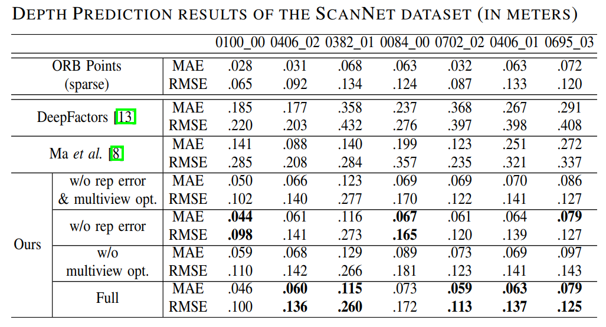
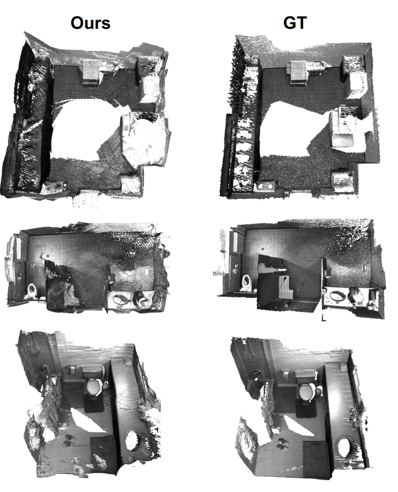
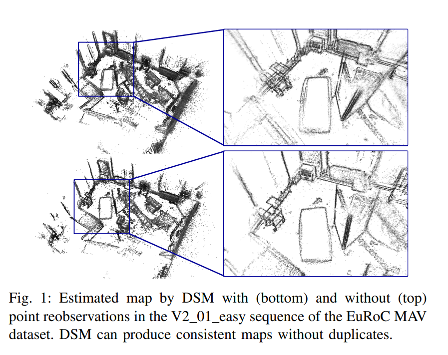

**笔记**

本笔记旨在整理2018-2021年间SLAM方向、基于特征点的视觉定位方向、势识别方向、VR方向的顶会顶刊论文。主要偏向于已经开源的项目，默认论文链接到对应github项目网址。

---

目录

[TOC]

---

## 分类

1. SLAM
2. 视觉定位
3. 手势识别
4. VR相关

### SLAM

#### [Robust Neural Routing Through Space Partitions for Camera Relocalization in Dynamic Indoor Environments](https://github.com/siyandong/NeuralRouting). CVPR, 2021 Oral

这篇文章是相机重定位的工作，尽管与视觉定位类似，但这里将相机重定位放到SLAM分类中。

了解到，在一些公开数据集合上，视觉定位技术在5cm/5°的精度误差范围内已经可以达到100%的准确，如7-sences、12-sences，采用决策树的方法去寻找2D/3D-3D的对应匹配关系，然后几何方法计算相机pose。但是决策树无法很好的处理动态的场景，因为决策树是根据静态场景中的已有图像序列学习得到的。

**名词解释**

Direct pose estimation ：直接通过输入的图片预测相机pose，传统的方法是基于图像检索，通过最相似数据库图片的pose计算查询图片pose，还有用CNN回归的，代表方法PoseNet，整体的精度表现跟图像检索类似，不如基于3D结构的方法。

Indirect pose estimation ：找到相机中和世界坐标的对应点，通过RANSAC优化匹配，找到2D-3D的对应，从而计算相机的pose。有两种方式，一种是图片关键点和3D场景地图匹配，一种是训练决策树预测相机3D点的世界坐标，再优化相机的pose。

**摘要**

在已知的室内环境中定位相机是场景建图、机器人导航、AR等领域的关键组成部分。最近的一些进展通过优化2D/3D摄像机空间和3D世界空间中的坐标之间的2D/3D-3D对应关系来估计摄像机的姿态。这些方法通过卷积神经网络或仅使用静态输入图像序列的决策树来估计姿态，使得它们容易受到动态室内环境的影响，而动态室内环境在现实世界中很常见，但也很有挑战性。为了解决上述问题，本文提出了一种新的离群值感知神经树，它将深度学习和决策树两种方法联系起来。

它建立在三个重要的模块上；

（a） 对室内场景进行分层空间划分，构造决策树；

（b） 一个神经路由函数，实现为一个深层分类网络，用于更好地理解三维场景；

（c） 离群点剔除模块，用于在分层路由过程中过滤出动态点。

提出的算法在为动态室内环境下的摄像机重定位而开发的RIO-10基准上进行了评估。它通过空间分割实现了健壮的神经路由，比最先进的方法提高了大约30%的摄像机姿态精度，同时运行速度也比较快。

本文通过空间分块，然后决策树分层的方法，将动态点去掉，只保留静态的点用于计算相机pose。其中计算pose的方式和算法整体上沿用了决策树的一般框架。主要有3块区别：

1）精确的空间分块，将每个点跨分到一个有物理意义的3D空间几何区域中；

2）神经网络路由，通过一个分类器网络将每个视觉观测到的样本点分配到对应的空间中，学习出一种3D场景理解；

3）外点筛除，即在决策树中，将动态点分类出来并筛除，最种只计算分类到稳定点的部分，即示意图中决策树实线的叶子节点。

**算法示意**

分为两步：

1）场景坐标回归

决策树的建立根据场景的3D信息，训练时候每个来自图像的查询点（RGB-D）会根据叶节点的3D点在世界坐标系中的分布和相机ground truth的重投影进行判断。因此在测试时候，输入的点可以在叶子节点找到3D-3D的对应关系，以用于后面的相机位姿估计。

这里的重点是如何识别外点，即动态点。

2）相机位姿估计

与一般决策树方法相同，不过这里根据众多3D-3D的匹配进行了优化，通过迭代估计每个叶节点的3D高斯分布来构建高斯混合模型 Gaussian Mixture Model (GMM)  ，一开始生成1024个pose假设，然后用局部优化的RANSAC方法优化pose。

结果展示：

#### [Why Having 10,000 Parameters in Your Camera Model Is Better Than Twelve](https://github.com/puzzlepaint/camera_calibration). CVPR, 2020

这是[ETH CVG](http://www.cvg.ethz.ch/index.php)的一个工作，关于相机畸变模型的一篇文章，提出非参数化模型比参数化模型要好。

**摘要**

相机校准是设置 3D 计算机视觉系统必不可少的第一步。常用的参数相机模型仅限于几个自由度，因此通常不能最佳地适应复杂的真实镜头失真。相比之下，通用相机模型由于其灵活性而允许非常精确的校准。尽管如此，它们在实践中几乎没有使用。在本文中，我们认为这应该改变。我们为通用模型提出了一个校准pipeline，该pipeline是完全自动化的、易于使用的，并且可以作为参数校准的直接替代品，重点是准确性。我们将我们的结果与参数校准进行比较。以立体深度估计和相机姿态估计为例，我们表明校准误差对结果有偏差。因此，我们认为，与当前的常见做法相比，通用模型应尽可能优于参数模型。为了促进这一点，我们发布了我们的校准pipeline，使每个人都可以使用易于使用和准确的相机校准。

**名词解释**

1. 参数化的畸变模型

目前最常见的畸变模型有：

1）Brown: 即径向+切向畸变，参数有 k1, k2, k3, p1, p2
2）Rational: 有理模型，可以看作 Brown 模型的扩展，参数有 k1, k2, k3, k4, k5, k6, p1, p2
3）KB: 所谓鱼眼模型，参数有 k1, k2, k3, k4

OpenCV中`calibrateCamera`通过14个参数支持Brown、Rational等模型，`fisheye::calibrate` 则用于标定 KB 模型。其它还有 FoV、UCM、[Double Sphere](https://doi.org/10.1109/3DV.2018.00069)等模型。

上述这些模型都可以归为“参数化模型”，因为它们都是使用带有少量参数的模型去拟合整张图像上全部像素点的畸变。

2. 非参数化的畸变模型

非参数化模型不是说没有参数，而是相对于参数化模型，它们会使用大量的参数去表示整张图的畸变。最极端的情况是每个像素点都有一组参数表示其畸变，即直接记录每一个点从带畸变图像到无畸变图像的映射（或者反过来的映射）。所以，OpenCV中的`initUndistortRectifyMap` 函数生成的映射表就可以理解为非参数化畸变模型的参数表。

显然，非参数化模型是参数化模型的拓展，它具有最大的灵活性，理论上能够用于拟合任意相机畸变。但同时越 General 的模型越容易过拟合，想要达到比较良好去畸变效果，非参数化模型需要的标定数据比参数化模型要多得多。

为了降低标定的难度，这篇论文提出了一种较为稀疏的非参数化模型：

如上图（a）所示，整个带畸变图像按照固定尺寸被划分为小的 Grid，每个 Grid 只有一个控制点，对应于一组畸变参数，即该控制点坐标到无畸变图像坐标的映射。对任意点进行去畸变操作时，先找到其周围 4×4 个控制点，然后使用基于B样条的双立方插值获得当前点的畸变参数，从而映射到无畸变坐标。
由于模型参数保存的是带畸变坐标到无畸变坐标的映射，这一方法能够很容易地实现点的去畸变 （对应 unproject 过程），但点的加畸变（对应 project 过程）却需要迭代才能实现。

**源码解读**

论文开源的代码是一个非常庞大的工程，甚至非线性优化求解器都实现了一遍。如果只是想了解并使用非参数化畸变模型，重点关注这几个文件即可：

1）`applications/camera_calibration/src/camera_calibration/b_spline.h`
清晰的插值计算过程
2）`applications/camera_calibration/src/camera_calibration/models/central_generic.cc`
标定相关的各种函数，包含 project、unporject、fitToModel 等
3）`applications/camera_calibration/generic_models/src/central_generic.h`
应用相关的各种函数，包含 project、unproject、save、load 等

#### [BAD SLAM: Bundle Adjusted Direct RGB-D SLAM](https://github.com/ETH3D/badslam). CVPR, 2019

ETH3D的Benchmark：https://www.eth3d.net/ 。主要任务是做SLAM和重建。
其中SLAM采用的是[BAD SLAM](https://openaccess.thecvf.com/content_CVPR_2019/papers/Schops_BAD_SLAM_Bundle_Adjusted_Direct_RGB-D_SLAM_CVPR_2019_paper.pdf)
BAD-SLAM：经捆绑调整的直接法RGB-D SLAM
主要贡献：
1）提出了一个新颖、快速的直接BA算法，在RGB-D SLAM中的应用效果优于其他方法。
2）发布一个经精确校准的RGBD SLAM基准数据集，即ETH3D中的SLAM数据集，可以应用到单目、双目视觉惯性SLAM中。相比以往的数据集，ETH3D数据集同步了全局快门相机，移除了受模型影响的因素（如卷帘快门）。benchmark展示了各类RGBD SLAM方法的排名。
3）benchmark和code是开源的，可在 www.eth3d.net 上获取。

#### [A Comparison of Modern General-Purpose Visual SLAM Approaches](https://arxiv.org/pdf/2107.07589.pdf). IROS, 2021

**摘要**

移动和腿式机器人技术的成熟度正在改变机器人的部署和发现环境。这项创新要求对同步定位和映射 (SLAM) 系统进行转型，以支持新一代的服务和消费机器人。当机器人被部署在多层室内、室外非结构化和城市领域时，传统上强大的 2D 激光雷达系统不再能占据主导地位，而且立体和 RGB-D 摄像头价格越来越便宜。视觉 SLAM (VSLAM) 系统几十年来一直是研究的主题，少数公开可用的实现已经脱颖而出：ORB-SLAM3、OpenVSLAM 和 RTABMap。
本文使用跨越服务机器人协商的多个领域的几个不同数据集，比较了这 3 种现代、功能丰富且独特稳健的 VSLAM 技术，这些技术尚未相互进行基准测试。ORB-SLAM3 和 OpenVSLAM 都没有与文献中至少一个这些数据集进行比较，我们通过这个镜头提供了洞察力。该分析旨在找到通用、功能完整和多域 VSLAM 选项，以支持广泛的机器人应用程序，以集成到新的和改进的 ROS 2 Nav2 系统中，作为传统 2D 激光雷达解决方案的合适替代方案。

论文中对当下比较好的开源工作都做了分析，出于视觉SLAM、有回环检测、纯定位、重定位模块的判断，选出了ORB-SLAM3、OpenVSLAM 和 RTABMap三种方法进行对比，这三种也比较有代表性，也相对支持的相机种类比较全，其中RTABMap是ROS默认的方法，ORB-SLAM是用得比较多的方法，OpenVSLAM是比较新的方法，模块化很好，同时适合研究和工程实践。

选取数据集：EuRoc MAV、TUM RGB-D、KITTI

对三种方法在三个数据集上进行了对比，结果如图：

对比结果：

总体上来说，ORB-SLAM3因为有IMU的加入，只有在加入IMU的时候表现才是比较好的，但是也经常会遇到分割错误，RTABMap方法虽然表现不是最好的，但是最稳定，综合精度表现和稳定性，OpenVSLAM是最优的选择。目前OpenVSLAM已经可以在ROS 2 Navigation 系统中作为一个可选的2D SLAM Toolbox进行使用。

根据下图可以看出，IMU的帮助很大，在实际研究和使用中，在可能的情况下，通常会首选结合 IMU 融合技术。

总结：

根据这些数据集上进行的对比发现，尽管VSLAM技术在理想条件下表现出色，但光照条件差或频繁变化的场景以及快速移动的场景会导致重定位能力显着下降。在评估的时候，仍必须考虑其环境的照明条件。在VSLAM的研究中，如何在可变光照条件下的重新定位和跟踪仍然是所有已研究的视觉SLAM 方法的一个最大的限制。

#### [DeepRelativeFusion Dense Monocular SLAM Using Single-Image Relative Depth Prediction](https://github.com/yan99033/MiDaS-cpp), IROS, 2021

这个工作是关于稠密单目SLAM的，与CodeMapping有些类似，也是在传统的稀疏SLAM方法上，研究场景稠密化重建的工作。

**名词解释**

LSD-SLAM：一种基于直接法的单目SLAM算法，这个单目SLAM系统可以实时在单个CPU上运行。LSD-SLAM和其它仅充当视觉里程计的直接法相比，它在全局地图上进行维护和图像跟踪，这个全局地图包含由关键帧组成的姿态图，以及关键帧对应的用概率方式表现的半稠密深度图组成。

主要创新点：

- 两帧关键帧之间，用 sim(3) 直接法来配准，明确纳入和检测尺度漂移。
- 一种概率方法，将深度图的噪声融合到图像跟踪中。地图以点云表示，其特点是，半稠密型而且是高精度的三维环境重构。

**摘要**

传统的单目视觉SLAM算法已经得到广泛应用，并证明了可以用来可靠地恢复稀疏结构和摄像机的运动。然而，稀疏结构对于场景交互，例如视觉导航和增强现实应用来说还不够。为了使场景重建更加稠密，一般使用单目图像绝对深度预测的方法，用卷积神经网络填补缺失的结构信息。不过，在和训练集不同的数据集上预测准确性泛化性能不是很好。

在本文中，我们提出了一种稠密的单目SLAM系统，命名为DeepRelativeFusion，它能够恢复全局一致的三维结构。我们使用了视觉SLAM算法可靠地恢复了摄像机姿态和关键帧的半稠密深度图，然后结合关键帧位姿图与稠密关键帧深度图来重建场景。为了实现地图稠密化，我们在能量最小化框架上引入了两个增量改进: (1)代价函数中的增加图像梯度项， (2) 使用单目图像相对深度预测。尽管没有绝对的比例尺和深度范围，利用来自SLAM的半密集深度地图，我们可以对相对深度图进行修正。

实验表明，修正的相对深度图对于稠密化先验来说精度够了。为了证明相对深度预测的泛化性 ，我们列举了两个室外的稠密重建序列。在量化对比结果中，我们的系统明显优于目前最新的在稠密重建SLAM系统。

**贡献**

• 第一个提出使用单图像相对深度预测而不是绝对深度预测来解决稠密单目 SLAM 问题；
• 定量和定性地表明相对深度图可实现最先进的重建精度；
• 引入一种结构保持和降噪的自适应滤波器，它通过单目SLAM 算法提高了半稠密结构的精度；
• 提出一种利用稠密和半稠密结构来改进估计的相机运动的方法，以改进其姿态估计。

方法流程

整体pipeline用深度预测模块、自适应滤波模块和密集映射模块来扩充 LSD-SLAM。 优化的深度图用于细化关键帧位姿图，而优化的关键帧位姿图与致密的深度图相结合以生成全局一致的 3D 结构。系统pipeline包含一个优化框架，它使用关键帧图像的预测深度图和过滤后的半密集深度图来执行稠密化。反过来，优化的深度图被用于优化由 LSD-SLAM 维护的关键帧姿态图。 为了重建场景，从优化的关键帧位姿图中获得的各自位姿对稠密深度图进行反向投影。

基本表示

在 LSD-SLAM 中，相机位姿的轨迹和地图点的 3D 位置存储在关键帧列表中。

**深度预测**

对于每个新的关键帧 $K_i$，我们从 MiDaS 中获得一个相对逆深度图（后面都称为相对深度图），用于半密集深度图的致密化。因为深度预测 $D_{i,CNN}$是相对深度图，所以预测的深度图需要进行缩放（scale）和移位校正（shift），然后才能用于致密化步骤。按如下方式执行比例和移位校正：
$$
D_{i,CNN}^{'}=aD_{i,CNN}+b
$$
这里的a和b就是scale和shift参数。

**半密集结构自适应滤波**

自适应滤波建立在双边滤波基础上。双边滤波器旨在根据图像$I$的窗口$\\N$内的中心像素 $x$ 和附近像素 $x_n$ 之间的几何接近度 $w_d(., .)$ 和光度相似性 $w_s(., .)$ 组合局部像素值 ，其定义为:
$$
I_{filtered}(x)=\frac{1}{W_{\\N}}\Sigma_{n \in{\\N}}(I(x_n)\text{exp}(-\frac{(I(x)-I(x_n))^2}{2\sigma_s^2})\text{exp}(-\frac{||x-x_n||^2}{2\sigma_d^2}))
$$
with
$$
W_{\\N}=\Sigma_{n \in {\\N}}w_s(x,x_n)w_d(x,x_n)
$$
在半密集深度图滤波的背景下，引入两种额外的加权方案，即 CNN 深度一致性 $w_c(., .)$ 和深度不确定性 $w_u(.)$，以去除具有较大局部方差的半密集深度像素与它们相应的 CNN 深度以及较大的深度不确定性相比：
$$
w_c(x,x_n)=\text{exp}(-\frac{({\frac{D_{i,semi-dense(x)}}{D_{i,semi-dense(x_n)}}}-{\frac{D_{i,CNN(x)}^{'}}{D_{i,CNN(x_n)}^{'}}})^2}{2\sigma_c^2})
\\
w_u(x_n)=\text{exp}(-\frac{\sigma_uV_{i,semi-dense}(x_n)}{D_{i,semi-dense}(x_n)^4})
$$

**效果**

下图是深度预测的效果对比和ATE的精度结果对比

#### [CodeMapping: Real-Time Dense Mapping for Sparse SLAM using Compact Scene](https://arxiv.org/pdf/2107.08994.pdf), IROS, 2021

code: 没找到源码，但论文是基于ORB-SLAM3的，并对[CodeSLAM](https://github.com/silviutroscot/CodeSLAM)的方法进行了改进，可以参考这两个的源码。

**名词解释**

**变分自编码器VAE**：变分自编码器（Variational Auto-Encoders，VAE）作为深度生成模型的一种形式，是由 Kingma 等人于 2014 年提出的基于变分贝叶斯（Variational Bayes，VB）推断的生成式网络结构。与传统的自编码器通过数值的方式描述潜在空间不同，它以概率的方式描述对潜在空间的观察，在数据生成方面表现出了巨大的应用价值。VAE一经提出就迅速获得了深度生成模型领域广泛的关注，并和生成对抗网络（Generative Adversarial Networks，GAN）被视为无监督式学习领域最具研究价值的方法之一，在深度生成模型领域得到越来越多的应用。

总结：是编码器的一种，不过是将原数据分布以概率的描述到新的空间中分布，于是可以学习到数据分布以用于数据生成。

参考：

https://zhuanlan.zhihu.com/p/34998569

https://zhuanlan.zhihu.com/p/64485020

**摘要**

我们为稀疏视觉 SLAM 系统提出了一种新颖的密集映射框架，该框架利用了紧凑的场景表示。最先进的稀疏视觉 SLAM 系统提供对相机轨迹和地标位置的准确可靠的估计。虽然这些稀疏地图对定位很有用，但它们不能用于其他任务，例如避障或场景理解。在本文中，我们提出了一个密集映射框架来补充稀疏视觉 SLAM 系统，该系统将 SLAM 系统产生的相机位姿、关键帧和稀疏点作为输入，并预测每个关键帧的密集深度图像。我们建立在 [CodeSLAM](https://github.com/silviutroscot/CodeSLAM)的基础上，并使用变分自动编码器 (VAE)，它以来自稀疏 SLAM 的强度、稀疏深度和重投影误差图像为条件来预测具有不确定性的密集深度图。然后使用 VAE 使我们能够通过多视图优化来细化密集深度图像，从而提高重叠帧的一致性。我们的映射器以松散耦合的方式在与 SLAM 系统并行的单独线程中运行。这种灵活的设计允许与任意度量稀疏 SLAM 系统集成，而不会延迟主 SLAM 过程。我们的密集映射器不仅可以用于局部映射，还可以通过 TSDF 融合用于全局一致的密集 3D 重建。我们展示了使用 ORB-SLAM3 运行的系统，并展示了准确的密集深度估计，这可以实现机器人和增强现实等应用。

**介绍**

标定SLAM精度的关键是信息点的选择（典型地，角点或边缘点）和相机Pose与地标位置的联合优化。与将地图构建和相机姿态估计分离的密集方法相比，稀疏 SLAM 产生更准确的结果。在实际应用中，稀疏 SLAM 通常与其他传感器融合以提高鲁棒性。然而，稀疏特征图没有视觉信息，不能直接用于无碰撞运动规划或表面感知 AR 等任务。许多方法都尝试同时实现密度映射（dense mapping）和相机自主定位，但是不如稀疏方法效果好，有两点原因：

- dense图像对其易受到光度噪声的影响。
- 大量场景参数限制了实时联合优化。

作者提出了 CodeMapping，这是一种利用稀疏 SLAM 提供的几何先验信息的实时密集映射方法：

- 扩展了 CodeSLAM 中提出的紧凑场景表示以完成稀疏点集。
- 训练一个 VAE 来预测一个密集的深度图，并在相应的灰度图像、一个来自地图中可观察特征的稀疏深度图像和一个重投影误差图像上对其进行调节，以实现不确定性感知深度补全。
  - 连续深度图通过使用 SLAM 系统提供的固定相机姿态的多视图优化进行细化，以提高其一致性和准确性。
- 我们的系统与 SLAM 系统并行工作，订阅估计的相机姿态、稀疏深度和重投影误差图。该方法为多视图密集束调整和实时执行提供了灵活的关键帧选择，而无需中断主要 SLAM 过程。
  

左边是一个稀疏点云，右边是作者重建出的稠密点云，下边是整个场景的点云。

**系统结构**

**跟踪**：跟踪使用传感器信息来估计相机相对于map的位姿，ORB-SLAM3执行仅有pose的BA，最小化匹配的投影误差，这个投影误差由当前图像和重建出的map得到。系统会自动决定这帧图像是不是关键帧。

**Mapping**：用于位姿和集合的精炼。关键帧数据包含相机pose，稀疏深度和再投影误差。其中稀疏深度是3Dlandmark再关键帧上的投影。投影误差是每一个3D landmark再所有帧上面的投影算出的误差的平均值。

**稀疏到稠密的预测**：利用深度学习预测出更稠密的深度图。

**多视角优化**：主要是增大depth的精度，后面细讲。下图给出了多视角优化的有效性。

**稀疏到稠密的预测**

1）网络结构

作者扩展了条件变分自动编码器 DeepFactors，网络如下图所示。网络输入有三种：灰度图，稀疏深度depth和重投影误差maps。与Code SLAM和DeepFactors相似，depth和重投影误差值归一化在 [0,1]之间。输入的三个数据可以concat为一个3通道的输入。

下层网络是一个变分自动编码器（VAE），由分解特征调节的网络。这个网络会生成一个潜在的特征c，稠密的深度图预测D和一个不确定性图b。损失函数由一个深度重建loss和一个KL散度loss构成。其中深度图重建的loss定义为：
$$
\Sigma_x \frac{||D(x)-D_{gt}(x)||}{b(x)}+log(b(x))
$$

x表示每一个像素点。

2）训练过程

使用ScanNet数据集中的40w张图片。为了生成输入需要的稀疏depth，在彩色图上利用ORB检测关键点，之后从这先点中从Kinect 深度图中选择1000个关键点。VAE的输入是Kinect生成的原始depth。生成的场景的3D模型投影到当前图像得到的depth作为真值，用于计算loss。

**多视角优化**

提出了几个系数，实际上就是利用自己提出的这几个优化函数，利用DeepFactor的方法进行优化。这几个系数实际上也很常见。

**光度系数**：这个原理很简单，根据depth和两帧图像之间的变换关系，可以将一个图像warp到另一个图像上，直接做差求和即可。

**再投影稀疏**：两组图像上有个匹配好的点，利用深度depth和pose，将图像上的一个点投影到另一个图像上，计算两个坐标的差异。

**稀疏几何系数**：这个就是将两个图像的depth统一到一个图像坐标系下，然后直接算depth的差异。

**效果**

总结：实验结果还是挺不错的，但是同类型的这种用图像预测pose和depth的网络方法很多，作者的网络结构看起来有点简单，尽管其用了很多辅助信息作为输入。同时，基于作者的各种辅助信息的使用以及训练的方式，其可能泛化性可能会存在一些问题，不过这也是采用学习类方法的目前共有的问题之一了。

#### [Fast and Incremental Loop Closure Detection using Proximity Graphs](https://github.com/anshan-ar/FILD). IROS, 2019

这篇文章讲的是闭环检测框架FILD，应用在线且增量的图词汇结构，表现SOTA

**摘要**

视觉闭环检测可以看作是一种图像检索任务，是SLAM系统中的研究热点。常用的BoW(bag-of-words)模型可以达到较高的精确度和稳健的查全率。然而，在移动机器人应用中对低时间成本和低内存成本的要求并没有得到很好的满足。本文提出了一种新的闭环检测框架FILD (Fast and Incremental loop closure detection)，重点研究一种用于快速闭环检测的在线且增量的图词汇结构。在GPU上使用卷积神经网络(CNN)和SURF来提取帧的全局和局部特征，这保证了非常快的提取速度。基于HNSW(Hierarchical Navigable Small World) 图表，并且对其进行改进，形成图表词汇结构以适应具体的应用。除此之外，该过程还结合了一种用于实时几何验证的新策略，该策略只保留二进制哈希码，显著地节省了内存使用。在几个公开的数据集上进行的大量实验表明，本文提出的方法在100%的精确度下可以达到相当好的查全率，表现SOTA。

**方法**

#### [Quadtree-Accelerated Real-Time Monocular Dense Mapping](https://github.com/HKUST-Aerial-Robotics/open_quadtree_mapping). IROS, 2018

利用四叉树加速的单目实时稠密建图。

**摘要**

在本文中，我们提出了一种用于机器人导航的新型映射方法。使用单个局部移动相机实时估计高质量的密集深度图并将其融合到 3D 重建中。强度图像的四叉树结构用于通过估计多个分辨率的深度图来减少计算负担。提出了基于四叉树的像素选择和动态置信传播来加速映射过程：根据像素在四叉树中的级别选择和优化计算资源。求解的深度估计被进一步插值并在时间上融合到全分辨率深度图中，并使用截断符号距离函数 (TSDF) 融合到密集的 3D 图中。我们使用公共数据集将我们的方法与其他最先进的方法进行比较。机载无人机自主飞行也用于进一步证明我们的方法在便携式设备上的可用性和效率。

**方法**

生成密集深度图和网格的方法的中间结果。 (c) 和 (d) 中的深度值采用彩虹色编码，红色代表 0.5m，紫色代表超过 10.0m。 首先根据图像的四叉树结构选择和估计像素的深度，然后将它们融合成高质量的全分辨率深度图和网格。 (c) 中提取的深度包含来自第 IV-D 节的动态置信传播的深度和来自第 IV-E 节的高梯度估计的深度估计。 注意（c）中提取的深度分布在包括低纹理区域在内的整个图像中，并很好地捕获了纹理和深度不连续区域，这对于进一步融合至关重要。

#### [Redesigning SLAM for Arbitrary Multi-Camera Systems](https://arxiv.org/pdf/2003.02014.pdf). ICRA, 2020

code: https://github.com/uzh-rpg/rpg_svo_pro_open

**摘要**

在SLAM系统中增加更多的相机可以提高鲁棒性和准确性，但会使视觉前端的设计变得非常复杂。因此，文献中的大多数系统是为特定的相机配置定制的。在这项工作中，我们的目标是一个适用于任意多相机设置的自适应SLAM系统。为此，我们重温了可视化SLAM中的几个常见构建块。特别是，我们提出了一个自适应初始化方案，一个传感器无关的信息论的关键帧选择算法，和一个可扩展的基于体素的地图。这些技术对实际的相机设置做了很少的假设，并且更喜欢基于理论的方法而不是启发式方法。通过这些修改，我们采用了最先进的视觉里程计，实验结果表明，修改后的流水线可以适应各种各样的摄像机设置(例如，一个实验中有2到6个摄像机)，而不需要传感器特定的修改或调整。

从论文中了解到，在困难环境中的鲁棒性依旧是SLAM系统的最大的问题挑战。增加摄像头的数目已经被证实是一种有效的解决方法，且被一些商业产品所采用，如Oculus Quest和Skydio。在论文认为，现代SLAM 系统的主要是基于关键帧的，只要对测量过程进行正确建模，像非线性优化这样的捆绑调整方法 (BA) 自然会推广到使用多个传感器，包括视觉惯性和多相机系统。但这样的前端缺少理论基础，只是单纯的测量的更加准确。在一些细节中模块中，如初始化、关键帧选择、地图管理等都是启发式的方法，不够明确和一般化。

针对以上，论文提出了：

1）adaptive initialization scheme：自适应初始化方案。

2）a sensor-agnostic, information-theoretic keyframe selection algorithm：与传感器无关的信息论关键帧选择算法

3）a scalable, voxel-based map management method：可扩展的基于体素的地图管理方法

**方法**

1）**自适应初始化**：核心是重叠检查。

两个摄像机之间立体重叠检查的图示，Ci和Cj。蓝星是相机I像面上的采样点，绿星是成功投影到相机j的3D点，红星是从像面上掉下来的点。

2）**基于熵的关键帧选择**：信息论，非启发式，根据关键帧捆绑姿势相对于当前地图的不确定性来选择关键帧。

a）Uncertainties Estimation in Nonlinear Least Squares：

在计算非线性最小二乘问题的迭代中，不确定性可以同时计算出来。其中，第i次的迭代为：
$$
(J^{T} \Sigma_{z}^{-1}J) \delta X_{i}= J^{T}r(X_{i})
$$
使用一阶近似，估计的协方差可以通过将测量噪声反向传播到参数来获得:
$$
\Sigma_x = (J^{T} \Sigma_{z}^{-1}J)^{-1}
$$
这也被称为费希尔信息。

b）Negative Pose Entropy in SLAM ：

SLAM中的负位姿熵，由于费希尔信息、相机姿态协方差可直接获得：
$$
I_{T}=J_{T}^{T} \Sigma_{u}^{-1}J_{T},\Sigma_T = (J_T^{T} \Sigma_{u}^{-1}J_T)^{-1}
$$
引入多元高斯分布的微分熵，定义负位姿熵来表示当前位姿估计的怎么样，该值越大说明估计地越好：
$$
E(T) \triangleq \ln (| I_{T} |)
$$
c）均值滤波选择关键帧：

上图为运行三次EuRoC MH 01数据集得到的负熵变化曲线。每次运行 的变换由不同颜色的线段表示，红点代表关键帧插入。可见随着关键帧插入而上升，随着远离局部地图而下降。

在插入新的关键帧后，由于有新的地图点生成，负熵增加，当相机远离最后一帧关键帧（局部地图）时，负熵下降直到新的关键帧被选择。另一方面，尽管是同一环境，负熵的值每次运行时也不相同。这表明使用绝对阈值作为关键帧选择标准是不可行的。

3）**体素地图查询**

对于新的输入图像，SLAM中的跟踪过程负责找到新图像中的观测值和地图中的3D点之间的对应关系。对于单目或双目，这可以通过仅搜索关键帧中与新帧重叠的点的匹配来有效地完成。而对于一般的多相机系统，由于不同相机的关键帧可能有很高的重叠率，这种方法会引入大量冗余。因此，论文将地图点组织在一个体素网格中，并且直接对相机锥台（图2所示）进行采样，来寻找可能的匹配点。

a）地图表示：用体素哈希技术来构建哈希表存储体素地图。哈希表中的每个条目都是在某个位置的用户定义大小的体素，它包含落在该体素中的3D点。哈希表中的体素通过整数世界坐标上的哈希函数来访问。因此，为了获得感兴趣位置周围的3D点，我们可以在恒定时间内直接获得相应的体素。地图仅在有3D点的地方分配体素，而不存储空的体素。体素哈希表与SLAM中的地图点生成同步。

b）地图查询：为了获得多相机系统的匹配地图点，我们在相机锥台（图2所示）中采样固定数量的点，并在体素图中找到相应的体素。然后，这些体素内的点用于匹配新图像中的观察值。这样就保证了从地图中检索到所有相机的FOV内的所有3D点。同时会避免共同点的冗余计算。

这里要注意：体素图只用来查询可见地标。关键帧仍然被选择用于三角测量和集束调整。

**结果**

在不同数量的相机下体素地图和关键帧地图方法的精度对比：

使用符号“er-m”来表示实验配置，其中 r 是以百分比表示的负熵选择阈值，m 是使用的地图类型（即体素或关键帧），default-kf 代表启发式关键帧选择方法以及关键帧地图。

**总结**

主要是针对多相机下复杂度剧增和硬编码问题的一种解决方案，同时对传统SLAM流程上有了一些创新和改动。

#### [Direct Sparse Mapping](https://github.com/jzubizarreta/dsm). IEEE Transactions on Robotics, 2019

DSM 是一种新颖的单目 SLAM 方法。它是一个完全直接的系统，可以估计相机轨迹和一致的全局地图。当使用相同的光度模型和地图点重新访问已绘制的区域时，它能够检测和处理地图点的重新观测。作者提供了在[EuRoC 数据集](https://projects.asl.ethz.ch/datasets/doku.php?id=kmavvisualinertialdatasets)和自定义视频中运行 SLAM 系统的[示例](https://projects.asl.ethz.ch/datasets/doku.php?id=kmavvisualinertialdatasets)。还为系统结果的 3D 可视化提供可选的 GUI。

**摘要**

光度束调整 (PBA) 可准确估计视频中的几何形状。 然而，当前的 PBA 系统有一个临时地图，无法管理场景的重新观察。 我们提出了 DSM，一个基于 PBA 的全单目视觉 SLAM。 它的持久地图处理重新观察，在 EuRoC 上为直接方法产生最新的最准确结果。

**论文贡献**

• 允许直接使用光度公式重用现有地图信息的持久地图。
• Local Map Covisibility Window (LMCW) 标准，用于选择观察同一场景区域的活动关键帧，即使它们没有及时关闭，也可以重新观察地图点。
• 证明PBA需要一个从粗到细的方案来收敛。 这利用了来自渲染高视差的关键帧的点重新观测所提供的丰富几何信息。
• 证明基于 t 分布的稳健影响函数与逐像素异常值管理策略一起提高了 PBA 对源自远距离关键帧激活的异常值的一致性。
• EuRoC 数据集中重建地图获得了最准确的结果。
• 开源了。

DSO和LDSO的缺点：

- 使用了不同的目标函数和点类型来完成里程计估计
- 闭环检测依赖于特征点的可重复性，损失一些可以用来矫正的点
- 闭环的误差较正均匀分布在关键帧上，这可能不是最优解
- 地图点的信息没有被reuse

**Direct Mapping**

- 跟踪线程以帧率速度输出位姿，会判断是否加入关键帧
- 建图线程处理新的帧，来跟踪关键帧上的点（候选点逆深度更新），插入关键帧会重新计算local window，**新的点，优化motion和structure。然后为了保证全局一致，移除外点，检测遮挡，避免点的重复。
  使用固定其它帧的方式来保证不可观自由度的一致性。

LMCW的初始解不在收敛半径内，所以使用粗到精的方式来优化，估计的几何作为下一层的初始值。

**LMCW: Local Map Covisibility Window**
由时间和共视策略组成，都是相对于最新关键帧的。

**时间窗口**主要目的是来优化新的点（初始化新点），并且保证里程计精度。

固定时间窗口的大小，从时间窗口移除关键帧的策略：

1) 总是保留上两个关键帧 $I_1$ 和 $I_2$ ，这保证里程计在挑战环境下（如大旋转）也能保证精度。避免关键帧过早的固定，保证被充分优化。
2) 其他的关键帧要均匀分布在空间中，丢弃有最大距离的，使得视差最大：
$$
s(I_i)=\sqrt{d(I_1,I_i)} \Sigma_{j=3}^{N_t}(d(I_i,I_j))^{-1}
$$
**共视窗口**是和时间窗口有共视关系的关键帧，要找到那些在最新关键帧空白区域有地图点投影的关键帧，具体的策略：

- 计算距离地图来确定耗尽区域，将时间窗口投影到最新关键帧，计算每个像素到最近地图点的距离。
- 选择具有最大数目投影点的旧关键帧，会剔除大于一定视角的点，来防止遮挡等情况。
- 更新距离地图
- 迭代执行第二步，直到选出足够数目，或者没有关键帧。

激活新地图点前，共视点已经完成投影，避免了提取重复的地图点，保证地图的一致性。

**Robust Non-Linear PBA**

LMCW的关键帧选取范围广，忽略了实际光度的不一致性，比如由于遮挡，光反射等。

提出根据光度误差的分布来剔除外点：
$$
\xi^* = {\textrm{argmin}\\{\xi}}-\Sigma_k^n \textrm{log}p(r_k|\xi)
$$
这里分布涉及三种，均匀分布、高斯分布和 t 分布。然后发现 t 分布能快速处理误差，给一个低权重。
$$
w_t(r_k)=\frac{v+1}{v+(\frac{r_k}{\sigma t })^2}, \textrm{when } \mu=0
$$

**M估计（Huber）**

无论误差的分布是难以知道还是假设为正态分布，使用 M-estimators 都是一种流行的解决方案。M 估计是基于最小二乘估计发展起来的一种抗差估计(Robust Estimation)方法。

估计的稳健性(Robustness)概念指的是在估计过程中产生的估计量对模型误差的不敏感性。M估计稳健回归的基本思想是采用迭代加权最小二乘估计回归系数，根据回归残差的大小确定各点的权$w_i$，以达到稳健的目的。

这里采用的是Huber estimator，虽然没有完全消除高误差测量，但会降低它们的影响，这对于重新观测处理至关重要。 Huber 权重函数定义为：
$$
w_h(r_k)=\begin{cases}\frac{1}{\sigma_n^2}
& \text{ if } |r_k|<\lambda \\ \frac{\lambda}{\sigma_n^2|r_k|}
& \text{ otherwise }
\end{cases}
$$
$\lambda = 1.345 \sigma_n \text{for } N(0,\sigma_n^2)$，这个值可以固定，也可以动态调节。

1）概率模型的实现

由于内点和外点的判定是动态的，会自动学习每个关键帧的误差分布，因此可以适用于不同的场景。在普通的关键帧上被认为是外点的，在一些挑战场景下会被认为是内点。

把这个误差分布作为权重加到目标函数，可能会每次迭代都改变目标函数，会使得优化降级。作者只在每个金字塔层的最开始计算误差分布，之后优化过程就固定。PBA结束最后会计算一次误差分布。

2）外点管理

低于目标帧95%的误差分布结果，被认为是内点。对于挑战的关键帧上，阈值会更高，相对宽松。对于普通帧，阈值降低，会更加严格。外点率大于30%就直接扔掉这个观测，如果优化中外点率大于60%就直接放弃这个优化。

要保留一个新点，必须在创建新关键帧后在所有新关键帧中对其进行观察，而在三个关键帧中对其进行观察则将其视为成熟点。 如果观察次数少于三个，则将删除成熟点。

**前端**

新的帧跟踪局部地图，地图点和参考关键帧被固定。使用coarse-to-fine优化，同时使用逆向组合法来避免jacobian的重新计算。

关键帧的判断（相对于最新关键帧）：

- 地图点的可视率（visibility ratio）
  $$
  s_u=\frac{\Sigma \text{min}(\frac{p_z}{p'_z},1)}{N}
  $$
  其中N是最新关键帧可见点总数，$p_z$, $p'_ z$ 分别是最新关键帧和跟踪帧的点逆深度。这个的作用是当相机靠近一个物体时，会创建更多的关键帧。

- 跟踪帧的基线长度

$$
s_t=||t\overline{p}||^2
$$

​		定义为帧间位移和跟踪局部地图上平均逆深度的比。作用相当于平移的距离足够大，超出视线范围

- 光照变化
  $$
  s_a=|a_k-a_i|
  $$
  如果以上加权后的满足下式子，则设置为关键帧。
  $$
  w_us_u+w_ts_t+w_as_a>1
  $$

**跟踪新地图点**
点会更新几帧后有低不确定性才被加入PBA，这种推迟的策略需要较好的初始值。为了保证有足够的点来激活，候选点在移出LMCW时才会被清除。激活的点是投影在空白区域的，当回到来过的地方，激活的点很少。

**效果**

DSM在具有挑战性的 EuRoC 数据集中成功完成了 11 个序列中的 10 个，RMS ATE 低于 0.1m，无需任何回环检测和校正。在相同环境中的长期序列期间，只要成功处理点重新观测，DSM 就可以提供可靠的估计。

**总结讨论**

即使使用了持久映射，也不可能在所有情况下处理所有重新观察。在大轨迹场景中，累积的漂移使得仅使用几何技术无法检测地图点的重新观测。有时，由于大漂移，地图点重新观测甚至不会落在相机视野中，例如在高速公路环路中。

所以需要一个重识别的功能（place recognition module），因为对于大场景，当误差累积较大时，可能有些点是没法重新投影过来，这个模块可以帮助检测回环。

==我的思考==：除了这个缺点之外，其计算量的需求或许是比较大的，或者说是计算效率不高，因为其遍历关键帧找寻共视的方法感觉还是比较耗时的，尽管有一些细节的避免重复计算的优化。

[Direct Sparse Odometry](https://github.com/JakobEngel/dso), IEEE Transactions on Pattern Analysis and Machine Intelligence，2017

**摘要**

我们提出了一种新颖的直接稀疏视觉里程计公式。它将完全直接的概率模型（最小化光度误差）与所有模型参数的一致、联合优化相结合，包括几何（在参考框架中表示为反深度）和相机运动。这是通过省略其他直接方法中使用的先验平滑度，而且是在整个图像中均匀采样像素来实时实现的。由于我们的方法不依赖于关键点检测器或描述符，它可以自然地从所有具有强度梯度的图像区域中采样像素，包括边缘或大部分白色墙壁上的平滑强度变化。所提出的模型集成了完整的光度校准，考虑了曝光时间、镜头渐晕和非线性响应函数。我们在包含几个小时视频的三个不同数据集上彻底评估了我们的方法。实验表明，在跟踪准确性和鲁棒性方面，所提出的方法在各种现实世界环境中显着优于最先进的直接和间接方法。

**概述**

DSO（Direct Sparse Odometry），是慕尼黑工业大学（Technical University of Munich, TUM）计算机视觉实验室的雅各布.恩格尔（Jakob Engel）博士，于2016年发布的一个视觉里程计方法。在SLAM领域，DSO属于稀疏直接法，据论文称能达到传统特征点法的五倍速度（需要降低图像分辨率），并保持同等或更高精度，代码见：JakobEngel/dso。然而，由于某些历史和个人的原因，DSO的代码清晰度和可读性，明显弱于其他SLAM方案如ORB、SVO、okvis等，使得研究人员很难以它为基础，展开后续的研究工作。

DSO属于稀疏直接法的视觉里程计。它不是完整的SLAM，因为它不包含回环检测、地图复用的功能。因此，它不可避免地会出现累计误差，尽管很小，但不能消除。DSO目前开源了单目实现，双目DSO的论文也已被ICCV接收。

DSO是少数使用纯直接法（Fully direct）计算视觉里程计的系统之一。与之对应的有：

- 1）SVO：半直接法，仅在前端的Sparse model-based Image Alignment部分使用了直接法，之后的位姿估计、bundle adjustment，则仍旧使用传统的最小化重投影误差的方式。

- 2）ORB-SLAM2：纯特征法，计算结果完全依赖特征匹配。

**特点**

直接法相比于特征点法，有两个非常不同的地方：

- 特征点法通过最小化重投影误差来计算相机位姿与地图点的位置，而直接法则最小化光度误差（photometric error）。所谓光度误差是说，最小化的目标函数，通常由图像之间的误差来决定，而非重投影之后的几何误差。
- 直接法将数据关联（data association）与位姿估计（pose estimation）放在了一个统一的非线性优化问题中，而特征点法则分步求解，即，先通过匹配特征点求出数据之间关联，再根据关联来估计位姿。这两步通常是独立的，在第二步中，可以通过重投影误差来判断数据关联中的外点，也可以用于修正匹配结果。

由于这个原因，DSO会一直求解一个比较复杂的优化问题，我们很难将它划分为像特征点法那样一步一步的过程。DSO甚至没有“匹配点”这个概念。每一个三维点，从某个主导帧（host frame）出发，乘上深度值之后投影至另一个目标帧（target frame），从而建立一个投影残差（residual）。只要残差在合理范围内，就可以认为这些点是由同一个点投影的。从数据关联角度看，在这个过程中并没有a1-b1, a2-b2这样的关系，也可能存在a1-b1, a2-b1, a3-b1这样的情况。但是DSO并不在意这些，只要残差不大，我们就看成是同一个点。这是很重要的一点。在特征点法中，我们可以找到一个地图点分别在哪些帧中被看到，乃至找到各帧中的图像描述子是什么；但在DSO中，我们会尝试把每个点投影到所有帧中，计算它在各帧中的残差，而并不在意点和点之间的一一对应关系。

**后端**

DSO使用一个由若干个关键帧组成的滑动窗口作为它的后端。这个窗口在整个VO过程中一直存在，并有一套方法来管理新数据的加入以及老数据的去除。具体来说，这个窗口通常保持5到7个关键帧。前端追踪部分，会通过一定的条件，来判断新来的帧是否可作为新的关键帧插入后端。同时，如果后端发现关键帧数已经大于窗口大小，也会通过特定的方法，选择其中一个帧进行去除。请注意被去除的帧并不一定是时间线上最旧的那个帧，而是会有一些复杂条件的。

后端除了维护这个窗口中的关键帧与地图点外，还会维护与优化相关的结构。特别地，这里指Gauss-Newton或Levenburg-Marquardt方法中的Hessian矩阵和b向量（仅先验部分）。当我们增加新的关键帧时，就必须扩展H和b的维度；反之，如果需要去掉某个关键帧（以及它携带的地图点）时，也需要降低H和b的维度。这个过程还需要将被删掉帧和点的信息，转移到窗口内剩余帧当中，这一步被称为**边缘化**（Marginalization）。

**框架**

DSO整体代码由四个部分组成：系统与各算法集成于src/FullSystem，后端优化位于src/OptimizationBackend，这二者组成了DSO大部分核心内容。src/utils和src/IOWrapper为一些去畸变、数据集读写和可视化UI代码。

参考：https://blog.csdn.net/weixin_41803874/article/details/84197226

#### [Continuous-Time vs. Discrete-Time Vision-based SLAM: A Comparative Study](https://rpg.ifi.uzh.ch/docs/RAL2021_Cioffi.pdf). RAL, 2022

**摘要**

机器人从业者通常通过离散时间公式来处理基于视觉的 SLAM 问题。这具有综合理论和对成功和失败案例的很好理解的优势。然而，当估计过程中存在来自不同传感器的高速和/或异步测量时，离散时间 SLAM 需要定制算法和简化假设。相反，实践者经常忽视的连续时间 SLAM 不受这些限制的影响。实际上，它允许异步集成新的传感器数据，而无需为每个新测量添加新的优化变量。通过这种方式，异步或连续高速传感器数据流的集成不需要定制和高度工程化的算法，从而能够以直观的方式融合多种传感器模式。不利的一面是，连续时间引入了一个先验，这可能会在某些不利情况下使轨迹估计恶化。在这项工作中，我们旨在系统地比较两种公式在基于视觉的 SLAM 中的优缺点。为此，我们进行了广泛的实验分析，改变了机器人类型、运动速度和传感器模式。我们的实验分析表明，与轨迹类型无关，只要传感器时间不同步，连续时间 SLAM 就优于其离散对应物。在这项工作的背景下，我们开发并开源了一种模块化且高效的软件架构，其中包含最先进的算法，以在离散和连续时间内解决 SLAM 问题。

**结果**

在EuRoC数据集上进行对比

#### [Volumetric Instance-Aware Semantic Mapping and 3D Object Discovery](https://github.com/ethz-asl/voxblox-plusplus). RAL, 2019

（voxblox++）有体积实体感知的语义建图和3D实体发现

**摘要**

为了在现实世界环境中自主导航和规划交互，机器人需要能够稳健地感知和构建复杂的、非结构化的周围场景地图。除了构建观察到的场景几何范围内的表示之外，对环境真正功能性理解的关键洞察是在建图期间使用更高级别的实体，例如单个对象实例。这项工作提出了一种在使用本地化 RGB-D 相机进行在线扫描期间增量构建以物体为中心的体积地图的方法。
具体步骤：
（1）单帧的RGB-D图像分割：基于深度的无监督几何分割+基于RGB的语义物体预测方案
（2）多帧分割的数据关联
（3）在voxblox上的扩展，构建包含实例标号和语义标号的全局TSDF地图

为了学习用于抓取和操作等任务的精确3D对象模型，机器人视觉系统应该能够在单个实例的级别上发现、分割、跟踪和重建对象。
以前的研究：
（1）检测RGB图像中的单个对象、预测每个像素的语义注释淹模
（2）稠密三维场景重建
融合(1) (2) 成功的在重建场景中定位和分割了语义上有意义的对象。
不足：只能够将检测结果归为训练过的对象。
（3）基于几何的方法，能够发现以前未见的场景元素，但是有过度分割和没有语义信息的这两个缺点。

这篇论文提出了一种逐步建立环境立体图的方法，该立体图中包含了在场景中观察到的单个对象实例的信息。特别是，面向对象的建图框架能查询识别出的语义对象的姿态和形状，以及以前未见过的对象实例的姿态和形状。
voxblox是基于几何的增量场景分割，对其扩展，产生一个完整的实例感知语义建图框架voxblox++。

方法：

#### [Unified Representation and Registration of Heterogeneous Sets of Geometric Primitives](https://gitlab.com/srrg-software/srrg_sasha), RA-L, 2019

这篇文章讲的是registration的方式来做tracking, geometric Primitives就是指环境中的几何元素（点，线，面）。

**摘要**

注册模型是许多机器人应用程序的重要组成部分。 在三维数据的情况下，要对齐的模型通常由点云组成。 本文中，我们提出以统一的方式表示由高级几何图元组成的场景，包括线和平面。 此外，我们推导出了一种迭代和直接的方法来确定异构场景（求解器）之间的转换。 我们分析了该求解器在合成数据上的收敛行为。 此外，我们对在我们的求解器之上实施的基于原始数据的完整注册管道进行了比较实验。在这个程度上，使用公共基准数据集，并将它们与最先进的方法进行了比较。 最后，提供了求解器的实现以及脚本，以简化本文中呈现的结果的再现。

首先，文章对于点线面使用统一的退化二次曲面（degenerate quadric）来表示。他们confidence分别是椭球体，线和面的表示从椭球退化成圆柱体和双平行平面。

对于一种特征（论文称matchable），存储的信息是： origin $p_*m$, rotation $R_*m$, eigenvalues matrix $\Omega_m$

其次，通过一个初始的pose, 将前一帧中的matchable转到当前帧中的matchable的信息. 然后建立平方距离 点的误差方程：
$$
e(m.m')=(P_m-P_{m'})^T A_{m'}(P_m-P_{m'})
$$

对于线和面，再增加另一个约束。$d_m$表示方向，$|d_m- d_{m^`}|$表示方向的距离。
$$
e(m.m')=||P_m-P_{m'}||_{A_{m'}}^2 +||d_m- d_{m^`}||^2
$$
最后，论文将这些误差方程叠加起来，最后优化。在高斯牛顿框架下，文章为误差方程提出了新的求解策略：非线性迭代求解器和直接求解器（direct solver）.

总结：

不知道这个文章是不是比特征法更优秀（运行是否更快），但是不同于特征法的部分比较多。值得学习的点在于他们的特征表示/tracking的方式。

### 视觉定位

#### [LoFTR: Detector-Free Local Feature Matching with Transformers](https://zju3dv.github.io/loftr/). CVPR, 2021

**名词解释**

Detector-based Local Feature Matching：需要对图像先进行关键点/特征检测，再进行描述，通过该描述进行匹配。

Detector-based Local Feature Matching：不对图像进行特征检测，直接生成特征描述或者特征的匹配。

**摘要**

本文提出了一种新的局部图像特征匹配方法。首先在粗粒度上建立图像特征的检测、描述和匹配，然后在精粒度别上细化亚像素级别的密集匹配，而不是依次执行图像特征检测、描述和匹配。与使用cost volume来搜索对应关系的密集方法相比，本文借鉴Transformer使用了自注意层和互注意层来获得两幅图像的特征描述符。这种方法提供的全局接受域使得能够在纹理较少的区域产生密集匹配

**方法**

LoFTR可以在**低纹理、运动模糊或图片模式重复**的区域产生高质量的匹配

方法结构图：

整体步骤分四步：

1）用CNN卷积两图像，生成高级的feature描述，作为粗粒度的特征表达，然后进行反卷积，生成细粒度的feature map；

2）将粗粒度的feature map flatten到1维，分别进行位置编码，然后输入到Transform中进行自注意力和互注意力的编码；

3）将编码后的输出，一个作行，一个作列，计算置信矩阵，即相关度计算，用于衡量匹配

4）这里把第一步生成的细粒度的feature map拿过来，根据第三步中的置信矩阵中的每个位置（i，j），因为细粒度是反卷积的，尺寸变大了，在细粒度上面对应的应该是一个小窗的区域w×w，然后在这个小窗里面进行亚像素级别的细致匹配预测。具体的，就是对裁剪下来的两个小窗，用一个跟第二步一样结构的模型，不过是小一点的（尺寸小），得出的结果进行相关性计算（热力图），估计概率分布。

监督信息：

总损失包括粗粒度损失和细粒度损失：
$$
L=L_{c}+L_{f}
$$
其中，粗粒度损失：沿用SuperGlue的方法，使用相机姿态和深度信息在训练中计算置信矩阵的GT作为监督信息。
$$
L_{c}=-\frac{1}{|M_{c}^{gt}|} \Sigma_{(\widehat{i},\widehat{j}^{'})\in M_{c}^{gt}} log P_{c}(\widehat{i},\widehat{j})
$$
细粒度损失：采用L2范数，计算每个点生成的heatmap的方差来测量不确定性 ，以使得细化后的匹配不确定性较低，从而得到加权损失的函数，GT也是通过像机姿态和深度信息计算得来，不过这里由于是裁剪一个窗口所以要进行空间变换，忽略变换后超出窗口的部分。
$$
L_{f}=\frac{1}{|M_{f}|} \Sigma_{(\hat{i},\hat{j}^{'})\in M_{f}} \frac{1}{\sigma^{2}(\hat{i})}||\hat{j}^{'}-\hat{j}^{‘}_{gt} ||
$$

思考：

很大程度上参考了superGlue的思想与方法，利用transformer的注意力机制来直接学习feature的匹配，然后feature本身通过卷积获得，所以跳过了关键点检测的步骤。整体思路比较清晰简明，粒度用粗到细，用的方法是一套，只是输入的规格变化了，这也要归功于注意力编码不会改变数据规格大小起到了类像素级别的对应作用。

#### [SuperPoint: Self-supervised interest point detection and description](https://github.com/rpautrat/SuperPoint). CVPRW, 2018

**摘要**

本文提出了一个自监督框架，用于训练适用于计算机视觉中大量多视图几何问题的兴趣点检测器和描述符。 与基于补丁的神经网络相反，我们的全卷积模型在全尺寸图像上运行，并在一次前向传递中联合计算像素级兴趣点位置和相关描述符。 我们介绍了单应性自适应，这是一种多尺度、多单应性方法，用于提高兴趣点检测的可重复性和执行跨域自适应（例如，合成到真实）。 我们的模型在使用 Homographic Adaptation 在 MS-COCO 通用图像数据集上进行训练时，能够重复检测比初始预适应深度模型和任何其他传统角点检测器更丰富的兴趣点集。 与 LIFT、SIFT 和 ORB 相比，最终系统在 HPatches 上产生了最先进的单应性估计结果。

**方法**

### 手势识别

#### [Camera-Space Hand Mesh Recovery via Semantic Aggregation and Adaptive 2D-1D Registration](https://github.com/SeanChenxy/HandMesh). CVPR, 2021

**摘要**

近年来，3D 手部网格恢复取得了重大进展。然而，由于固有的 2D 到 3D 模糊性，从单个 RGB 图像恢复相机空间 3D 信息仍然具有挑战性。为了解决这个问题，我们将相机空间网格恢复分为两个子任务，即根相对网格恢复和根恢复。首先，从单个输入图像中提取联合地标和轮廓，为 3D 任务提供 2D 线索。在根相关网格恢复任务中，我们利用关节之间的语义关系从提取的 2D 线索中生成 3D 网格。这种生成的 3D 网格坐标相对于根位置（即手的手腕）表示。在根恢复任务中，通过将生成的 3D 网格对齐回 2D 线索，将根位置注册到相机空间，从而完成相机空间 3D 网格恢复。我们的管道是新颖的，因为（1）它明确利用关节之间的已知语义关系，（2）它利用轮廓和网格的一维投影来实现稳健的配准。在 FreiHAND、RHD 和 Human3.6M 等流行数据集上进行的大量实验表明，我们的方法在根相对网格恢复和根恢复方面均实现了最先进的性能。我们的代码在这个 https URL 上是公开的。

**方法**

### VR相关

#### [GDR-Net: Geometry-Guided Direct Regression Network for Monocular 6D Object Pose Estimation](https://github.com/THU-DA-6D-Pose-Group/GDR-Net). CVPR, 2021

**摘要**

从单个RGB图像中进行6D姿态估计是计算机视觉中的一项重要任务。目前最先进的基于深度学习的方法依赖于一种间接的策略，即首先在图像平面坐标系和目标坐标系之间建立2D-3D的对应关系，然后应用PnP/RANSAC算法的变体。然而，这种两级pipeline不是端到端可训练的，因此很难用于许多需要微分姿态的任务。另一方面，目前基于直接回归的方法不如基于几何的方法。在这项工作中，我们对直接和间接方法进行了深入的研究，并提出了一种简单而有效的几何引导直接回归网络（GDR-Net）来从基于密集对应的中间几何表示中以端到端的方式学习6D姿态。大量实验表明，在LM、LM-O和YCB-V数据集上，我们的方法明显优于最先进的方法。

通过利用包含 2D-3D 密集对应和表面区域注意的中间几何特征的指导，使用 CNN 和可学习的 Patch-PnP 直接从单个 RGB 回归 6D 对象姿态。

