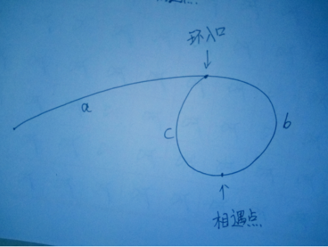

## 刷题

### **nowcoder**

JZ4：重建二叉树

题解：就是根据前序和中序遍历的结果，重建二叉树。

方法：首先要把遍历二叉树的过程给回忆一下

前序：根——>左——>右，

中序：左——>根——>右

后序：左——>右——>根

显然，前序的话，根节点一定是第一个，中序的话一定是在中间，然后中序的话根的左边是左子树，右边是右子树，所以显然用**递归**的话很简单就想到了，按照前序找到根节点，把中序遍历分成左右子树，然后又分别是一样的情况，因为中序遍历的话，子树也是中序遍历的顺序。

```c++
//任201803231505918, 5940473
/*
struct TreeNode {
    int val;
    TreeNode* left;
    TreeNode* right;
    TreeNode(int x) : val(x), left(NULL), right(NULL) {}
};
*/
class Solution {
public:
    TreeNode* reConstructBinaryTree(vector<int> pre, vector<int> vin) {
        return rebuilt(0, 0, pre.size() - 1, pre, vin);
    }
    TreeNode* rebuilt(int prestart, int vinstart, int size, vector<int> pre, vector<int> vin) {
        if (prestart >= pre.size() || vinstart > size) {
            return nullptr;
        }
        TreeNode* root = new TreeNode(pre[prestart]);
        int ii = 0;
        for (int i = vinstart; i <= size; i++) {
            if (pre[prestart] == vin[i]) {
                ii = i;
                break;
            }
        }
        root->left = rebuilt(prestart + 1, vinstart, ii - 1, pre, vin);
        root->right= rebuilt(prestart + 1 + ii - vinstart, ii + 1, size, pre, vin);
        return root;
    }
};
```


JZ17：树的子结构

题意：输入两棵二叉树A，B，判断B是不是A的子结构。（ps：我们约定空树不是任意一个树的子结构）

方法：遍历A树所有节点，判断子节点的树结构是否跟B树的结构一样

```c++
class Solution {
public:
    bool IsSubtree(TreeNode* pRoot1, TreeNode* pRoot2){
        if(pRoot2==NULL)
            return true;
        if(pRoot1==NULL)
            return false;
        if(pRoot1->val!=pRoot2->val)
            return false;
        else
        {
            return IsSubtree(pRoot1->left,pRoot2->left) && IsSubtree(pRoot1->right,pRoot2->right);
        }
        //return false;
    };
    bool HasSubtree(TreeNode* pRoot1, TreeNode* pRoot2)
    {
        if(pRoot1 ==NULL || pRoot2==NULL){
            return false;
        }
        bool re=false;
        if (pRoot1!=NULL&&pRoot2!=NULL)
        {
            //if(pRoot1->val==pRoot2->val)
            //这个判断可加可不加，因为IsSubtree里面有判断
            re=IsSubtree(pRoot1,pRoot2);
            if(!re)
                re=HasSubtree(pRoot1->left,pRoot2);
            if(!re)
                re=HasSubtree(pRoot1->right,pRoot2);
        }
        return re;
    }
};
```


JZ21：栈的压入、弹出序列

题解：就是两个序列A，B，判断B是否为A的出栈序列。

方法：模拟A的入栈和出栈，然后以B的元素顺序最为出栈的指导。用一个向量vector当作栈，每次压栈，判断栈顶元素是否跟B的对应序列元素相同，一样就出栈，继续判断，不一样就继续按照A顺序压栈，最后把A的元素压弯，判断栈中元素是否能够都出来，都出来就说明B是一个正确的出栈顺序。

```c++
class Solution {
public:
    bool IsPopOrder(vector<int> pushV,vector<int> popV) {
        if(pushV.empty()&&popV.empty())
            return true;
        int l=pushV.size();
        vector<int> record;
        int k=0;
        for(int i=0;i<l;i++){
            record.push_back(pushV[i]);
            while(!record.empty()&&record.back()==popV[k]){
                record.pop_back();
                k++;
                }
            }
        if (record.empty())
            return 1;
        else
            return 0;
    }
```


JZ22：从上往下打印二叉树

题意：从上往下打印出二叉树的每个节点，同层节点从左至右打印。

方法：用上队列就很简单了，就是一个层序遍历，这里要注意的是队列的使用方法，先进先出，C++里面queue.pop()是void类型的，没有返回值的，要取队列首位元素需要用到queue.front()，然后别忘了再pop一下。

```c++
class Solution {
public:
    vector<int> PrintFromTopToBottom(TreeNode* root) {
        vector<int>re;
        //第一次提交没有加这个异常检测，没有通过，还是要边界检测呀
        if (root == NULL) {
            return re;
        }
        queue<TreeNode*>q;
        q.push(root);
        while (!q.empty())
        {
            root = q.front();
            q.pop();
            re.push_back(root->val);
            if (root->left != NULL)
                q.push(root->left);
            if (root->right != NULL)
                q.push(root->right);
        }
        return re;
    }
};
```


JZ24： 二叉树中和为某一值的路径

题意：输入一颗二叉树的根节点和一个整数，按字典序打印出二叉树中结点值的和为输入整数的所有路径。路径定义为从树的根结点开始往下一直到叶结点所经过的结点形成一条路径。

方法：这类问题可以用**带记忆的DFS**来解决。

一个这类问题的典型解法

```c++
class Solution {
public:
    vector<vector<int> > FindPath(TreeNode* root,int expectNumber) {
		vector< vector<int> > re;
        vector<int>pn;
		if(root)
			dfs(root,expectNumber,re,pn);
		return re;
    }
	void dfs(TreeNode* root,int s,vector<vector<int>>&re,vector<int> &trace){
		trace.push_back(root->val);
		if(root->left==NULL && root->right==NULL){
			if(root->val==s)
				re.push_back(trace);
		}
		if(root->left)
			dfs(root->left,s-root->val,re,trace);
		if(root->right)
			dfs(root->right,s-root->val,re,trace);
		trace.pop_back();
	}
};
```

理解：有点像是寻路，**字典序就是先序**

- 递归先序遍历树， 把结点加入路径。
- 若该结点是叶子结点则比较当前路径和是否等于期待和。
- 
  弹出结点，每一轮递归返回到父结点时，当前路径也应该回退一个结点

非递归：

```python
# -*- coding:utf-8 -*-
# class TreeNode:
#     def __init__(self, x):
#         self.val = x
#         self.left = None
#         self.right = None
class Solution:
    # 返回二维列表，内部每个列表表示找到的路径
    def FindPath(self, root, expectNumber):
        # write code here
        # write code here
        if root == None:
            return []
        result = []
        stack = []
        stack.append((root, [root.val]))
        while stack:
            node, path = stack.pop()
            if node.left == None and node.right == None and sum(path) == expectNumber:
                result.append(path)
            if node.right != None:
                stack.append((node.right, path + [node.right.val]))
            if node.left != None:
                stack.append((node.left, path + [node.left.val]))
        return result
```


JZ25：复杂链表的复制

题意：输入一个复杂链表（每个节点中有节点值，以及两个指针，一个指向下一个节点，另一个特殊指针random指向一个随机节点），请对此链表进行深拷贝，并返回拷贝后的头结点。（注意，输出结果中请不要返回参数中的节点引用，否则判题程序会直接返回空）输入一个复杂链表（每个节点中有节点值，以及两个指针，一个指向下一个节点，另一个特殊指针random指向一个随机节点），请对此链表进行深拷贝，并返回拷贝后的头结点。（注意，输出结果中请不要返回参数中的节点引用，否则判题程序会直接返回空）

方法：主要就是随机地指针不好复制，带有顺序信息在里面，这里需要借助原有链表的顺序。所以考虑先在原链表每个节点后面都加上一个复制的节点，这样也就有顺序了，再按照这样的次序给random指针赋值，最后把这个链表按照奇偶次序拆分成两个。

```c++
class Solution {
public:
    RandomListNode* Clone(RandomListNode* pHead)
    {     
        /*
        1、复制每个节点，如：复制节点A得到A1，将A1插入节点A后面
        2、遍历链表，A1->random = A->random->next;
        3、将链表拆分成原链表和复制后的链表
        */
        if(pHead==NULL){
            return NULL;
        }
        RandomListNode *clonehead=pHead;
        while(pHead!=NULL){
            RandomListNode *temp=new RandomListNode(pHead->label);
            temp->next=pHead->next;
            pHead->next=temp;
            pHead=temp->next;
        }
        RandomListNode *head=clonehead;
        while(clonehead!=NULL){
            if(clonehead->random!=NULL)
                clonehead->next->random=clonehead->random->next;
            clonehead=clonehead->next->next;
        }
        RandomListNode*result=head->next;
        RandomListNode*cur;
        while(head->next!=NULL){
            cur=head->next;
            head->next=cur->next;
            head=cur;
        }
        return result;
    }
};
```


JZ26:二叉搜索树与双向链表

题意：输入一棵二叉搜索树，将该二叉搜索树转换成一个排序的双向链表。要求不能创建任何新的结点，只能调整树中结点指针的指向。

方法：首先，二叉搜索树的性质是：根左小右大，本身有序，如果是中序遍历的话，就是顺序的，问题是双向链表返回的应该是最小或者最大的那个表头，所以考虑怎么返回左子树的最左节点，没有则是根节点，至于双向链表的顺序，只要将左子树的最右节点找到连上根节点，右子树的最左节点连上根节点就行。

两种方法：

一种，找左最右和右最左改变指针方向，返回左最左

```c++
class Solution {
public:
    TreeNode* Convert(TreeNode* pRootOfTree)
    {
        if(pRootOfTree==NULL)  return NULL;//递归边界
        if(pRootOfTree->left==NULL && pRootOfTree->right==NULL)  return pRootOfTree;//递归边界
        
        TreeNode* left = Convert(pRootOfTree->left);//递归左边
        TreeNode* p = left;
        while(p!=NULL && p->right!=NULL)//找左子树最右节点
            p = p->right;//当p->right为NULL的时候跳出循环
        if(left)//若左子树不空
        {
            p->right = pRootOfTree;
            pRootOfTree->left = p;
        }
        TreeNode* right = Convert(pRootOfTree->right);//递归右边
        if(right)//若右子树不空
        {
            pRootOfTree->right = right;
            right->left = pRootOfTree;
        }
        return left ? left : pRootOfTree;
    }
};
```


第二种，简单点，就是中序遍历

这里说明一下，个人认为像中序遍历那样，左中右或者右中左遍历修改指针都可以，但是这个牛客网上的题目通过好像只有返回最小的那个指针才能通过，也就是最左边的，所以如果采用左中右的方式的话，需要多申请一个指针存下最左边的那个节点，，，

我想了很久为什么直接输出右边的指针就是不行，是不是我理解错了？不过我试验了一下，故意输出右边的，就是不通过的，说明题目就是这样要求的，我没有理解错，不过会做就行了，理解算法就行啦，刷题嘛，不纠结。

```c++
class Solution {
public:
    //这是 左-中-右 的顺寻
    TreeNode* leftHead = NULL;
    TreeNode* rightHead  = NULL;
    TreeNode* Convert(TreeNode* pRootOfTree)
    {
        
        if(pRootOfTree==NULL)  return pRootOfTree;//递归边界
        Convert(pRootOfTree->left);
        if(rightHead==NULL){
            leftHead=rightHead=pRootOfTree;
        }else{
            rightHead->right=pRootOfTree;
            pRootOfTree->left=rightHead;
            rightHead=pRootOfTree;
        }
        Convert(pRootOfTree->right);
        return leftHead;
	}
}；
```

```c++
class Solution {
public:
    //这是 右-中-左 的顺序
    TreeNode* leftHead = NULL;
    //TreeNode* rightHead  = NULL;
    TreeNode* Convert(TreeNode* pRootOfTree)
    {
       if(pRootOfTree==NULL)  return pRootOfTree;//递归边界
        Convert(pRootOfTree->right);
        if(rightHead==NULL){
            leftHead=pRootOfTree;
        }else{
            leftHead->left=pRootOfTree;
            pRootOfTree->right=leftHead;
            leftHead=pRootOfTree;
        }
        Convert(pRootOfTree->left);
        return leftHead;
    }
};
```


JZ28： 数组中出现次数超过一半的数字

题意：数组中有一个数字出现的次数超过数组长度的一半，请找出这个数字。例如输入一个长度为9的数组{1,2,3,2,2,2,5,4,2}。由于数字2在数组中出现了5次，超过数组长度的一半，因此输出2。如果不存在则输出0。

方法：最简单的，暴力求解，用字典一个一个统计个数，然后遍历一下，超过半长度的个数输出。一次成功。

c++的字典用map实现。

```c++
class Solution {
public:
    int MoreThanHalfNum_Solution(vector<int> numbers) {
        int l=numbers.size();
        map<int,int>dic;
        for(int i=0;i<l;i++){
            dic[numbers[i]]++;
        }
        map<int,int>::iterator it=dic.begin();
        for(it;it!=dic.end();it++){
            if(it->second>(l/2))
                return it->first;
        }
        return 0;
    
    }
};
```

方法二：数组排个序，查过半长的数字在中间一定有，也就是直接返回中间元素就行。

代码略，快排一下，返回就行。


**题目提示用位操作和分治，再思考一下。。。**

JZ31:整数中1出现的次数

题意：求出1~13的整数中1出现的次数,并算出100~1300的整数中1出现的次数？为此他特别数了一下1~13中包含1的数字有1、10、11、12、13因此共出现6次,但是对于后面问题他就没辙了。ACMer希望你们帮帮他,并把问题更加普遍化,可以很快的求出任意非负整数区间中1出现的次数（从1 到 n 中1出现的次数）。

方法：找规律，

编程之美上给出的规律：

1. 如果第i位（自右至左，从1开始标号）上的数字为0，则第i位可能出现1的次数由更高位决定（若没有高位，视高位为0），等于更高位数字 * 当前位数的权重 10<sup>i-1</sup> 。

2. 如果第i位上的数字为1，则第i位上可能出现1的次数不仅受更高位影响，还受低位影响（若没有低位，视低位为0），等于更高位数字 * 当前位数的权重10<sup>i-1</sup>+（低位数字+1）。

3. 如果第i位上的数字大于1，则第i位上可能出现1的次数仅由更高位决定（若没有高位，视高位为0），等于（更高位数字+1）* 当前位数的权重 10<sup>i-1</sup>。

设定整数点（如1、10、100等等）作为位置点i（对应n的各位、十位、百位等等），分别对每个数位上有多少包含1的点进行分析。

- 根据设定的整数位置，对n进行分割，分为两部分，高位n/i，低位n%i
- 当i表示百位，且百位对应的数>=2,如n=31456,i=100，则a=314,b=56，此时百位为1的次数有a/10+1=32（最高两位0~31），每一次都包含100个连续的点，即共有(a/10+1)*100个点的百位为1
- 当i表示百位，且百位对应的数为1，如n=31156,i=100，则a=311,b=56，此时百位对应的就是1，则共有a/10(最高两位0-30)次是包含100个连续点，当最高两位为31（即a=311），本次只对应局部点00~56，共b+1次，所有点加起来共有（a/10*100）+(b+1)，这些点百位对应为1
- 当i表示百位，且百位对应的数为0,如n=31056,i=100，则a=310,b=56，此时百位为1的次数有a/10=31（最高两位0~30）
- 综合以上三种情况，当百位对应0或>=2时，有(a+8)/10次包含所有100个点，还有当百位为1(a%10==1)，需要增加局部点b+1
- 之所以补8，是因为当百位为0，则a/10==(a+8)/10，当百位>=2，补8会产生进位位，效果等同于(a/10+1)

```c++
class Solution {
public:
    int NumberOf1Between1AndN_Solution(int n)
    {
        int ones = 0;
        for (long long m = 1; m <= n; m *= 10) {
            int a = n/m, b = n%m;
            ones += (a + 8) / 10 * m + (a % 10 == 1) * (b + 1);
        }
        return ones; 
    }
};
```


JZ32：把数组排成最小的数

题意：输入一个正整数数组，把数组里所有数字拼接起来排成一个数，打印能拼接出的所有数字中最小的一个。例如输入数组{3，32，321}，则打印出这三个数字能排成的最小数字为321323。

方法：根据题意来看，每个元素是不能更改的，其实按照一种顺序就可以把最小的数字直接拿出来，很简单，就是数字越小越往前，但是因为这里每个元素的数字是不可拆分的，所以就要整体排序，排序不难，那么多种，这里就给了简单的冒泡，关键是如何判断两个元素的大小，同样位数的应该是尽量让小的数字往前，不同位数的，就对应高位来比较，就是从左往右比较大小，位数少但是数字大的也算大。。。这样就简单了。

```c++
class Solution {
public:
    string PrintMinNumber(vector<int> numbers) {
        string re = "";
        int l = numbers.size();
        //这里就是简单的冒泡排序，，，，，，
        for (int i = 0; i < l; i++) {
            for (int j = i + 1; j < l; j++) {
                if (biger(numbers[i], numbers[j])) {
                    int t = numbers[i];
                    numbers[i] = numbers[j];
                    numbers[j] = t;
                }
            }
            re += to_string(numbers[i]);
        }
        return re;
    }
    //判断大小
    bool biger(int a, int b) {
        int abit = 1, bbit = 1;
        int m=a, n=b;
        while (m /= 10) {
            abit*=10;
        }
        while (n /= 10)
        {
            bbit*=10;
        }
        while (abit || bbit) {
            if (abit != 0) {
                m = a / abit;
                a %= abit;
                abit /= 10;
            }
               
            if (bbit != 0) {
                n = b / bbit;
                b %= bbit;
                bbit /= 10;
            }
            if (m>n)
                return true;
        }
        return false;
    }
};
```


LZ34：第一个只出现一次的字符

题意：在一个字符串(0<=字符串长度<=10000，全部由字母组成)中找到第一个只出现一次的字符,并返回它的位置, 如果没有则返回 -1（需要区分大小写）.（从0开始计数）

方法：比较简单，遍历两次，第一次计数，第二次找答案。可以用哈希，用map实现，也可以直接就是用一个52大小（区分大小写）的数组来计数。

```c++
class Solution {
public:
    int FirstNotRepeatingChar(string str) {
        int l=str.length();
        map<char,int>hash;
        for(int i=0;i<l;i++){
            hash[str[i]]++;
        }
        for(int i=0;i<l;i++){
            if(hash[str[i]]==1)
                return i;
        }
        return -1;
    }
};
```


JZ35：数组中的逆序对

题意：在数组中的两个数字，如果前面一个数字大于后面的数字，则这两个数字组成一个逆序对。输入一个数组,求出这个数组中的逆序对的总数P。并将P对1000000007取模的结果输出。 即输出P%1000000007

输入

1,2,3,4,5,6,7,0

输出：

7

方法：首先，暴力求解，不行；然后归并排序，顺带计数。。。

```c++
/*参考《剑指offer》，有两种思路。第一就是暴力求解法，时间复杂度为o（n^2）,空间复杂度o(1)
第二种思路就是使用归并排序的思想进行处理，时间复杂度o(nlog(n)),空间复杂度0（n）*/
class Solution {
public:
    int InversePairs(vector<int> data) {
        if(data.size()<=1)return 0;
        int *copy=new int[data.size()];
        //初始化该数组，该数组作为存放临时排序的结果，最后要将排序的结果复制到原数组中
        for(unsigned int i=0;i<data.size();i++)
            copy[i]=0;
        //调用递归函数求解结果
        int count=mergrsort(data, copy, 0, data.size()-1);
        delete[]copy;
        return count;
    }
    int mergrsort(vector<int>& data,int* &copy,int start, int end){
        if(start==end){
            copy[start]=data[start];
            return 0;
        }
         //将数组拆分成两部分
        int length=(end-start)/2;//这里使用的下标法，下面要用来计算逆序个数；也可以直接使用mid=（start+end）/2
        //分别计算左边部分和右边部分
        int left=mergrsort(data, copy, start,start+length)%1000000007;
        int right=mergrsort(data, copy, start+length+1, end)%1000000007;
        //进行逆序计算
        int i=start+length;//前一个数组的最后一个下标
        int j=end;//后一个数组的下标
        int index=end;//辅助数组下标，从最后一个算起
        int count=0;
        while(i>=start && j>=start+length+1){
            if(data[i]>data[j]){
                copy[index--]=data[i--];
                //统计长度
                count+=j-start-length;
                //if(count>=1000000007)
                count%=1000000007;
            }
            else{
                copy[index--]=data[j--];
            }
        }
        for(;i>=start;--i){
            copy[index--]=data[i];
        }
        for(;j>=start+length+1;--j)
        {
            copy[index--]=data[j];
        }
        //排序
        for(int i=start; i<=end; i++) {
            data[i] = copy[i];
        }
        //返回最终的结果
        return (count+left+right)%1000000007;
    }
};
```


JZ36：两个链表的第一个公共结点

题意：输入两个链表，找出它们的第一个公共结点。（注意因为传入数据是链表，所以错误测试数据的提示是用其他方式显示的，保证传入数据是正确的）

方法：

1. 暴力求解：遍历寻找

   或者，遍历一遍，得到两条链表的长度，让长的先走到和短的一样长的头部，再两个链表逐节点比较，因为两条长度必然是**a+n**和**b+n**的关系。

```c++
/*
struct ListNode {
	int val;
	struct ListNode *next;
	ListNode(int x) :
			val(x), next(NULL) {
	}
};*/
class Solution {
public:
    ListNode* FindFirstCommonNode( ListNode* pHead1, ListNode* pHead2) {
        ListNode* re=pHead2;
        while (pHead1)
        {
            pHead2=re;
            while (pHead2)
            {
               if(pHead2==pHead1)
                    return pHead2;
                pHead2=pHead2->next;
            }
            pHead1=pHead1->next;
        }
        return NULL;
    }
};
```

2. 思考一下，是不是可以不管长度呢？跟之前找环类似，可以用两个指针循环扫描”两个链表“，最终两个指针总会到达 null 或者到达公共结点。

   可能不是最优解，但比暴力可能好一点。并不一定。

```c++
class Solution {
public:
    ListNode* FindFirstCommonNode( ListNode *pHead1, ListNode *pHead2) {
    	ListNode *p1 = pHead1;
        ListNode *p2 = pHead2;
        while(p1!=p2){
            p1 = (p1==NULL ? pHead1 : p1->next);
            p2 = (p2==NULL ? pHead2 : p2->next);
        }
        return p1;
    }
};
```

3. 再思考一下：把上面的方法改一点点。

   不需要存储链表的额外空间。也不需要提前知道链表的长度。看下面的链表例子：
   0-1-2-3-4-5-null
   a-b-4-5-null
   代码的ifelse语句，对于某个指针p1来说，其实就是让它跑了连接好的的链表，长度就变成一样了。
   如果有公共结点，那么指针一起走到末尾的部分，也就一定会重叠。看看下面指针的路径吧。
   p1： 0-1-2-3-4-5-null(此时遇到ifelse)-a-b-4-5-null
   p2:  a-b-4-5-null(此时遇到ifelse)0-1-2-3-4-5-null
   **因此，两个指针所要遍历的链表就长度一样了！**

```c++
class Solution {
public:
    ListNode* FindFirstCommonNode( ListNode *pHead1, ListNode *pHead2) {
    	ListNode *p1 = pHead1;
        ListNode *p2 = pHead2;
        while(p1!=p2){
            //就是把这个变成null，即到达尾部之后，接着走另外一个链表
            p1 = (p1==NULL ? pHead2 : p1->next);
            p2 = (p2==NULL ? pHead1 : p2->next);
        }
        return p1;
    }
};
```


JZ37:数字在升序数组中出现的次数

题意：统计一个数字在升序数组中出现的次数。

方法：二分搜索，找到第一个出现和最后一个出现的位置。

```c++
//因为data中都是整数，所以可以稍微变一下，不是搜索k的两个位置，而是搜索k-0.5和k+0.5
//这两个数应该插入的位置，然后相减即可。
class Solution {
public:
    int GetNumberOfK(vector<int> data ,int k) {
        return biSearch(data, k+0.5) - biSearch(data, k-0.5) ;
    }
private:
    int biSearch(const vector<int> & data, double num){
        int s = 0, e = data.size()-1;      
        while(s <= e){
            int mid = (e - s)/2 + s;
            if(data[mid] < num)
                s = mid + 1;
            else if(data[mid] > num)
                e = mid - 1;
        }
        return s;
    }
};
```


JZ39:平衡二叉树

题意：输入一棵二叉树，判断该二叉树是否是平衡二叉树。在这里，我们只需要考虑其平衡性，不需要考虑其是不是排序二叉树

方法：dfs，两层递归，一个获取深度，一个判断平衡

```c++
class Solution {
public:
    bool IsBalanced_Solution(TreeNode* pRoot) {
        if(pRoot==NULL)
            return true;
        int l=dfs(pRoot->left);
        int r=dfs(pRoot->right);
        // 注意平衡二叉树的定义：任意节点左右子数高度不能相差超过1
        if(abs(l-r) > 1)
            return false;
        else;
            return IsBalanced_Solution(pRoot->left) && IsBalanced_Solution(pRoot->right);
    }
    int dfs(TreeNode* pRoot){
        if(pRoot==NULL)
            return 0;
        int l=dfs(pRoot->left);
        int r=dfs(pRoot->right);
        return l>r?l+1:r+1;
    }
};
```

改进：有些递归可以减少，不必要访问那么多次。怎么办？

**记录状态**，怎么记呢，发现所有深度都是>=0的，所以，就用一个负数记录好了。比如-1.只要有个根节点不是平衡的，则不必要再去遍历其他节点和子树。

```c++
class Solution {
public:
    bool IsBalanced_Solution(TreeNode* pRoot) {
        int re=height(pRoot);
        if(re==-1)
            return false;
        return true;
    }
     int height(TreeNode* pRoot){
        if(!pRoot)
            return 0;
        int l=height(pRoot->left);
        if(l==-1)
            return -1;
        int r=height(pRoot->right);
        if(r==-1)
            return -1;
        if(abs(l-r)>1)
            return -1;
        else
            return max(l,r)+1;
    }
};
```


JZ40: 数组中只出现一次的数字

题意：一个整型数组里除了两个数字之外，其他的数字都出现了两次。请写程序找出这两个只出现一次的数字。

这次是看的网上的解析才懂得（捂脸，太巧妙了）

方法：可以用哈希或者异或的方法，哈希就不多说了，一次遍历map构建一下，计数，二次遍历查数，对应赋值。这里给出一个在下认为最为巧妙的方法，**异或**。

异或的性质：

1. 交换律;
2. 结合律;
3. **a^a=0, a^0=a**, a^(-1)=~a。

所以：对于任意的a，有a^b^c^d^a^k = b^c^d^k^(a^a) = b^c^d^k^0 = b^c^d^k，也就是说，如果有多个数异或，其中有重复的数，则无论这些重复的数是否相邻，都可以根据异或的性质将其这些重复的数消去，具体来说，如果重复出现了偶数次，则异或后会全部消去，如果重复出现了奇数次，则异或后会保留一个。

下面来看两道题目：

1. 1-1000放在含有1001个元素的数组中，只有唯一的一个元素值重复，其它均只出现一次。每个数组元素只能访问一次，设计一个算法，将它找出来；不用辅助存储空间，能否设计一个算法实现？

    当然，这道题，可以用最直观的方法来做，将所有的数加起来，减去1+2+3+...+1000的和，得到的即是重复的那个数，该方法很容易理解，而且效率很高，也不需要辅助空间，唯一的不足时，如果范围不是1000，而是更大的数字，可能会发生溢出。我们考虑用异或操作来解决该问题。现在问题是要求重复的那个数字，我们姑且假设该数字式n吧，如果我们能想办法把1-1000中除n以外的数字全部异或两次，而数字n只异或一次，就可以把1-1000中出n以外的所有数字消去，这样就只剩下n了。我们首先把所有的数字异或，记为T，可以得到如下：

   ​				T = 1^2^3^4...^n...^n...^1000 = 1^2^3...^1000（结果中不含n）

   而后我们再让T与1-1000之间的所有数字（仅包含一个n）异或，便可得到该重复数字n。如下所示：

   ​				T^(a^2^3^4...^n...^1000) = T^(T^n) = 0^n = n

    这道题到此为止。

2. 一个数组中只有一个数字出现了一次，其他的全部出现了两次，求出这个数字。

   明白了上面题目的推导过程，这个就很容易了，将数组中所有的元素全部异或，最后出现两次的元素会全部被消去，而最后会得到该只出现一次的数字。该题目同样可以该为如下情景，思路是一样的：数组中只有一个数字出现了奇数次，其他的都出现了偶数次。

再来看JZ40，

采用同样的方法可以去除掉出现2次的数，但是最后的结果是只出现1次的两个数的异或结果，所以需要把这两个数给分开，怎么分呢？其他的数字其实不用考虑，因为一样的数字哪哪都是有一样的，只需要把那两个只出现1次的不一样的数字分开就行，这里还可以用到前面异或的结果，异或的本质是啥？不就是不一样为1吗，那么只要找到该结果里面一个为1的位（**不用怀疑前面的异或结果找不到1，如果找不到，说明那两个数是一样的，因为相同的数字才会异或结果为0**），不就说明这连个数字在该位上是一个1，一个0吗，然后就按这个标准分成两个数组，分别全部异或一下，不就求出这两个数字了吗。太精妙了。

```c++
class Solution {
public:
    void FindNumsAppearOnce(vector<int> data,int* num1,int *num2) {
		if(data.size() < 2) return ;
        int myxor = 0;
        int flag = 1;
        for(int i = 0 ; i < data.size(); ++ i )
            myxor ^= data[i];
        while((myxor & flag) == 0) flag <<= 1;
        //这一步就是找那个1，找到一个就行，随便哪一位，这里是从地位往高位找的。
        *num1 = myxor;
        *num2 = myxor;
        for(int i = 0; i < data.size(); ++ i ){
            //根据找到的那一位1，把数组分成了两个分别全部累计异或
            if((flag & data[i]) == 0) *num2 ^= data[i];
            else *num1 ^= data[i];
        }
    }
};
```


JZ41：和为S的连续正数序列

题意：字面意思，一个整数有多少种连续的数之和的组成方法。

方法：穷举。

```c++
class Solution {
public:
    vector<vector<int> > FindContinuousSequence(int sum) {
        int i=1;
        vector<vector<int> >re;
        vector<int>t;
        int s=sum;
        int b=i;
        while(i<sum){
            t.push_back(i);
            s-=i;
            i++;
            if(s==0){
                re.push_back(t);
                t.clear();
                if(s==b)
                    break;
                b++;
                i=b;
                s=sum;   
            }
            if(s<i){
                t.clear();
                b++;
                i=b;
                s=sum;
            }
           
        }
        return re;
    }
};
```

一开始以为是任意数的和的组成有多少种，还用了map来作为字典防止重复，，，，

```c++
class Solution {
public:
    vector<vector<int> > FindContinuousSequence(int sum) {
        int i=1;
        vector<vector<int> >re;
        vector<int>t;
        int s=sum;
        int b=i;
        map<vector<int>,int>m;
        while(i<sum){
            t.push_back(i);
            s-=i;
            i++;
            if(s<0){
                t.clear();
                b++;
                i=b;
                s=sum;
            }
            if(s<b){
                // int ii=t.back();
                // t.pop_back();
                // t.push_back(ii+s);
                if(s!=0)
                    t.insert(t.begin(),s);
                m[t]++;
                if(m[t]<=1)
                    re.push_back(t);
                t.clear();
                if(s==b)
                    break;
                b++;
                i=b;
                s=sum;   
            }
        }
        return re;
    }
};
```

JZ42：和为S的两个数字

题目：输入一个递增排序的数组和一个数字S，在数组中查找两个数，使得他们的和正好是S，如果有多对数字的和等于S，输出两个数的乘积最小的

方法：

最简单的暴力解

但我知道，成绩最小的解一定是相差最大的，即最两头的

```c++
class Solution {
public:
    vector<int> FindNumbersWithSum(vector<int> array,int sum) {
        vector<int>re;
        int i=0,j=1;
        if(array.size()<1)
            return re;
        if(array.size()==2){
            if(re[0]+re[1]==sum){
                re.push_back(re[0]);
                re.push_back(re[1]);
            }
            return re;
        }
        int s=sum;
        for(i;i<array.size();i++){
            s-=array[i];
            for(j=i+1;j<array.size();j++){
                if(array[j]==s){
                    re.push_back(array[i]);
                    re.push_back(array[j]);
                    break;
                }
                if(array[j]>s)
                    break;
            }
            if(re.size()>1)
                break;
            s=sum;
        }
        return re;
    }
};
```

双指针：

根据前面的理解，其实就可以直接从两头开始找，头尾俩指针i=0，j=n-1，

若ai + aj == sum，就是答案（相差越远乘积越小）

若ai + aj > sum，aj肯定不是答案之一（前面已得出 i 前面的数已是不可能），j -= 1

若ai + aj < sum，ai肯定不是答案之一（前面已得出 j 后面的数已是不可能），i += 1

```c++
class Solution {
public:
    vector<int> FindNumbersWithSum(vector<int> array,int sum) {
        vector<int>re;
        int i=0,j=array.size()-1;
        while(i<j){
            if(array[i]+array[j]==sum){
                re.push_back(array[i]);
                re.push_back(array[j]);
                break;
            }
            while(i<j && array[i]+array[j]<sum) i++;
            while (i<j && array[i]+array[j]>sum) j--;
        }
        return re;
    }
};
```


JZ43:左旋转字符串

题意：汇编语言中有一种移位指令叫做循环左移（ROL），现在有个简单的任务，就是用字符串模拟这个指令的运算结果。对于一个给定的字符序列S，请你把其循环左移K位后的序列输出。例如，字符序列S=”abcXYZdef”,要求输出循环左移3位后的结果，即“XYZdefabc”。

方法：

```c++
class Solution {
public:
    string LeftRotateString(string str, int n) {
        //最简单的方法，暴力求解，超内存
        // char t;
        // for(int i=0;i<n;i++){
        //     t=str[0];
        //     str.erase(str.begin());
        //     str+=t;
        // }
        // return str;

        //动点脑筋，发现规律
        // string re="";
        // for(int i=n;i<str.length();i++){
        //     re+=str[i];
        // }
        // for(int i=0;i<n;i++){
        //     re+=str[i];
        // }
        // return re;
        
       //灵活利用字符串翻转。假设字符串abcdef，n=3，设X=abc，Y=def，所以字符串可以表示成XY，如题干，问如何求得YX。假设X的翻转为XT，XT=cba，同理YT=fed，那么YX=(XTYT)T，三次翻转后可得结果。
        //<algorithm>头文件包含的翻转函数
        // reverse(str.begin(), str.end());
        // reverse(str.begin(), str.begin() + str.size() - n);
        // reverse(str.begin() + str.size() - n, str.end());
        // return str;
        
        //自己写翻转函数，两种方式
        //先整体翻转，再局部，注意翻转位置
        // if(str=="")
        //     return str;
        // reflow(str,0,str.length()-1);
        // reflow(str,0,str.length()-n-1);
        // reflow(str,str.length()-n,str.length()-1);
        // return str;
        
        //先局部翻转，再整体
        if(str=="")
            return str;
        reflow(str,0,n-1);
        reflow(str,n,str.length()-1);
        reflow(str,0,str.length()-1);
        return str;
    }
    void reflow(string &str,int start,int end){
        char t;
        while(start<end){
            t=str[start];
            str[start]=str[end];
            str[end]=t;
            start++;
            end--;
        }
    }
};
```


JZ44：翻转单词顺序列

题意：翻转如“student. a am I”成“I am a student.”

方法：记录空的位置，逐个局部翻转，再整体翻转

```c++
class Solution {
public:
    string ReverseSentence(string str) {
        vector<int>index;
        index.push_back(-1);
        for(int i=0;i<str.length();i++){
            if(str[i]==' ')
                index.push_back(i);
        }
        int d=str.length();
        while(index.size()>0){
            reverse(str.begin()+index.back()+1,str.begin()+d);
            d=index.back();
            index.pop_back();
        }
        reverse(str.begin(),str.end());
        return str;
    }
};
```


JZ45:扑克牌顺子

题意：判断扑克牌是否构成顺子

方法：暴力求解，先排序，再判断

```c++
class Solution {
public:
    bool IsContinuous( vector<int> numbers ) {
        if(numbers.size()==0)
            return false;
        int count=0;
        for(int i=0;i<numbers.size();i++){
            for(int j=i+1;j<numbers.size();j++){
                if(numbers[i]>numbers[j]){
                    int temp=numbers[i];
                    numbers[i]=numbers[j];
                    numbers[j]=temp;
                }
            }
        }
        int base=0;
        for(int i=0;i<numbers.size();i++){
            if(numbers[i]==0)
                count++;
            if(base==0)
                base=numbers[i];
            else{
                if(numbers[i]==base)
                    return false;
                count-=(numbers[i]-base-1);
                base=numbers[i];
                if(count<0)
                    return false;
            }
        }
        return true;
    }
};
```

或者根据题意，也就是5张牌，加上扑克牌的数字有限，可以找到一点规律

max 记录 最大值
min 记录 最小值
min ,max 都不记0
满足条件即可为顺子：

1. max - min <5；
2. 除0外没有重复的数字(牌)

```c++
class Solution {
public:
    bool IsContinuous( vector<int> numbers ) {
        if(numbers.size()==0)
            return false;
        int min=14;
        int max=-1;
        int d[14]={0};
        for(int i=0;i<numbers.size();i++){
            d[numbers[i]]++;
            if(numbers[i]==0)
                continue;
            if(d[numbers[i]]>1)
                return false;
            if(numbers[i]>max)
                max=numbers[i];
            if(numbers[i]<min)
                min=numbers[i];
        }
        if(max-min>=5)
            return false;
        return true;
    }
};
```


JZ46: 孩子们的游戏(圆圈中最后剩下的数)

题意：。。。。

方法：

1. 模拟游戏过程

```c++
class Solution {
public:
    int LastRemaining_Solution(int n, int m)
    {
        if(n==0)
            return -1;
        vector<int>index;
        for(int i=0;i<n;i++){
            index.push_back(i);
        }
        int i=0;
        int count=0;
        while(index.size()>1){
            if (count==m-1){
                index.erase(index.begin()+i);
                count=0;
            }
            else{
                i++;
                count++;
            }
            if(i>=index.size()){
                i=0;
            }
        }
        return index[0];
    }
};
```

2. 约瑟夫环问题，找规律，然后用动态规划

```python
使用动态规划。我们注意到，输入的序列在删除一个元素后，序列的长度会改变，如果索引
在被删除的元素位置开始计算，那么每删除一个元素，序列的长度减一而索引会完全改变。
如果能找到改变前的索引和新索引的对应关系，那么该问题就容易解决了。
我们定义一个函数f(n, m)，表示每次在n个数字0,1,2,3,…,n-1中每次删除第m个数字后剩下
的数字。那么第一个被删除的数字的索引是(m-1)%n。删除该索引元素后，剩下的n-1个数字
为0,1,2,…,k-1,k+1,…,n-1。下次删除数字是重k+1位置开始，于是可以把序列看
作k+1,..,n-1,0,1,…,k-1。该序列最后剩下的序列也是f的函数。但该函数和第一个函数
不同，存在映射关系，使用f'来表示，于是有：f(n, m)=f'(n-1, m)。接下来需要找到映射关系。
k+1 --> 0
k+2 --> 1
     .
     .
     .
n-1 --> n-k-2
0   --> n-k-1
     .
     .
     .
k-1 --> n-2
所以可以得到：right = left-k-1，则p(x) = (x-k-1)%n，而逆映射是p'(x) = (x+k+1)%n
即0~n-1序列中最后剩下的数字等于（0~n-2序列中最后剩下的数字+k）%n，很明显当n=1时，
只有一个数，那么剩下的数字就是0.问题转化为动态规划问题，关系表示为：
 
    f(n)=(f(n-1)+m)%n； 当n=1,f(1)=0;
    
    class Solution:
    def LastRemaining_Solution(self, n, m):
        # write code here
  
        if n < 1 or m < 1:
            return -1
        last = 0
        for i in range(2, n+1):
            last = (last+m)%i
        return last
```


JZ49: 把字符串转换成整数

题意：将一个字符串转换成一个整数，要求不能使用字符串转换整数的库函数。 数值为0或者字符串不是一个合法的数值则返回0

方法：就用ASCII 码来判断字符是否为数字，逐位进行转换。不记得ASCII码是多少的，可以直接用char字符‘0’和‘9’来判断，即char(str[i])<='9' && char(str[i])>='0'  

```c++
class Solution {
public:
    int StrToInt(string str) {
        int re=0;
        int bit=1;
        for(int i=str.length()-1;i>=0;i--){
            if(int(str[i])<=57 && int(str[i])>=48){
                re+=bit*(int(str[i])-48);
                bit*=10;
            }else if(i==0){
                if(str[i]=='+')
                    return re;
                if(str[i]=='-')
                    return -re;
                return 0;
            }
            else{
                return 0;
            }
        }
        return re;
    }
};
```


JZ50：

题意：

方法：

1. 字典，map或者hash记录一下

```c++
class Solution {
public:
    // Parameters:
    //        numbers:     an array of integers
    //        length:      the length of array numbers
    //        duplication: (Output) the duplicated number in the array number
    // Return value:       true if the input is valid, and there are some duplications in the array number
    //                     otherwise false
    bool duplicate(int numbers[], int length, int* duplication) {
        if(length<=1){
            return false;
        }
        map<int,int>dic;
        for(int i=0;i<length;i++){
            dic[numbers[i]]++;
            if(dic[numbers[i]]>1){
                duplication[0]=numbers[i];
                return true;
            }
        }
        return false;
    }
};
```

2. 抓住题目，说是长度为n的数组，然后元素也都是0到n-1的，所以，可以用n来记录一下，所以可以利用现有数组设置标志，当一个数字被访问过后，可以设置对应位上的数 + n或者-n，之后再遇到相同的数时，会发现对应位上的数已经大于等于n了，那么直接返回这个数即可。

```c++
class Solution {
public:
    bool duplicate(int numbers[], int length, int* duplication) {
        for(int i=0;i<length;i++){
           int index=numbers[i];
           if(index<0){
               index+=length;
           }
           if(numbers[index]<0){
               duplication[0]=numbers[index]+length;
               return true;
           }
           numbers[index]-=length;
        }
        return false;
            // int index = numbers[i];
            // if (index >= length) {
            //     index -= length;
            // }   
            // if (numbers[index] >= length) {
            //     duplication[0]=numbers[index]-length;
            //     return index;
            // }   
            // numbers[index] = numbers[index] + length;
        // }   
        // return 0 ; 
    }
};
```

JZ51：

题意：用已知的A数组创建B，要求 B[i]=A[0] * A[1]*...* A[i-1] * A[i+1] * ... * A[n-1]

方法：

1. 暴力解法，ac

```c++
class Solution {
public:
    vector<int> multiply(const vector<int>& A) {
        vector<int>re;
        int temp=1;
        for(int i=0;i<A.size();i++){
            temp=1;
            for(int j=0;j<A.size();j++){
                if(j!=i){
                    temp*=A[j];
                }
            }
            re.push_back(temp);
        }
        return re;
    }
};
```

2. 动态规划，记录除了自己，左边的乘积和右边的乘积

看成一个矩阵，记录已经计算过的，避免重复计算。

```c++
//B[i]=A[0]*A[1]*...*A[i-1]*A[i+1]*...*A[n-1]
//从左到右算 B[i]=A[0]*A[1]*...*A[i-1]
//从右到左算B[i]*=A[i+1]*...*A[n-1] 
class Solution {
public:
    vector<int> multiply(const vector<int>& A) {
        vector<int>re(A.size());
        int ret=1;
        for(int i=0;i<A.size();i++){
            re[i]=ret;
            ret*=A[i];
        }
        ret=1;
        for(int i=A.size()-1;i>=0;i--){
            re[i]*=ret;
            ret*=A[i];
        }
        return re;
    }
};

```


JZ53:

题意：判断字符串是否表示数字

方法：

1. 正则表达式，正好可以回忆一下正则表达式的一些表达方式，不过因为c++没有官方的实现，这里给出python的代码。（偷懒警告）

```python
# -*- coding:utf-8 -*-
import re 
class Solution:
    # s字符串
    def isNumeric(self, s):
        # write code here
        return re.match(r"^[\+\-]?[0-9]*(\.[0-9]*)?([eE][\+\-]?[0-9]+)?$",s)
```

2. 编译原理学过状态机，，，，懒得写，先去看看，，，


JZ55: 链表中环的入口结点

题意：给一个链表，若其中包含环，请找出该链表的环的入口结点，否则，输出null。

方法：我最先想到的就是给遍历过的链表做标记，这样再见到的话就知道有环了，没有环到了尾巴就返回。

这里是用的map来标记遍历过的链表，有个问题，怎么判断是同一个链表呢？最严格的是直接判断链表的指针节点ListNode*，当然我这里是判断节点的元素int值，能够通过说明测试用例的链表元素是互异的，不过这里把 map<int,int> 改成 map<ListNode *,int> 也是可以的。

```c++
class Solution {
public:
    ListNode* EntryNodeOfLoop(ListNode* pHead)
    {
        map<int,int>c;
        while (pHead!=NULL)
        {
            c[pHead->val]++;
            if(c[pHead->val]>=2){
                return pHead;
                break;
            }
            pHead=pHead->next;
        }
        return NULL;
    }
```

看到网上的一个解法，思路清奇，数学贼好，反正我是想不到的。

```c++
class Solution {
public:
    ListNode* EntryNodeOfLoop(ListNode* pHead)
    {
        ListNode*fast=pHead,*low=pHead;
        while(fast&&fast->next){
            fast=fast->next->next;
            low=low->next;
            if(fast==low)
                break;
        }
        if(!fast||!fast->next)return NULL;
        low=pHead;//low从链表头出发
        while(fast!=low){//fast从相遇点出发
            fast=fast->next;
            low=low->next;
        }
        return low;
    }
};
```

（转自讨论区）

**思路：**

  设置快慢指针，都从链表头出发，快指针每次**走两步**，慢指针一次**走一步**，假如有环，一定相遇于环中某点(结论1)。接着让两个指针分别从相遇点和链表头出发，两者都改为每次**走一步**，最终相遇于环入口(结论2)。以下是两个结论证明：

两个结论：

**1、设置快慢指针，假如有环，他们最后一定相遇。**

**2、两个指针分别从链表头和相遇点继续出发，每次走一步，最后一定相遇与环入口。**

**证明结论1**：设置快慢指针fast和low，fast每次走两步，low每次走一步。假如有环，两者一定会相遇（因为low一旦进环，可看作fast在后面追赶low的过程，每次两者都接近一步，最后一定能追上）。

**证明结论2：**

设：

链表头到环入口长度为--**a**

环入口到相遇点长度为--**b**

相遇点到环入口长度为--**c**

**
**

则：相遇时

**快指针路程=a+(b+c)k+b** ，k>=1 其中b+c为环的长度，k为绕环的圈数（k>=1,即最少一圈，不能是0圈，不然和慢指针走的一样长，矛盾）。

**慢指针路程=a+b**

快指针走的路程是慢指针的两倍，所以：

**（a+b）\*2=a+(b+c)k+b**

化简可得：

**a=(k-1)(b+c)+c** 这个式子的意思是： **链表头到环入口的距离=相遇点到环入口的距离+（k-1）圈环长度**。其中k>=1,所以**k-1>=0**圈。所以两个指针分别从链表头和相遇点出发，最后一定相遇于环入口。

这里我是这么理解的：不管k取多少，相遇点一定是入口处不会变，k如果大一点，可能就是走的步数多一点，但是c走完了以后，就已经在入口了，因为是整圈数，转来转去都会是在入口这同一位置相遇的。

JZ66: 机器人的运动范围

题意：地上有一个m行和n列的方格。一个机器人从坐标0,0的格子开始移动，每一次只能向左，右，上，下四个方向移动一格，但是不能进入行坐标和列坐标的数位之和大于k的格子。 例如，当k为18时，机器人能够进入方格（35,37），因为3+5+3+7 = 18。但是，它不能进入方格（35,38），因为3+5+3+8 = 19。请问该机器人能够达到多少个格子？

方法：

1.从(0,0)开始走，每成功走一步标记当前位置为true,然后从当前位置往四个方向探索，返回1 + 4 个方向的探索值之和。

2.探索时，判断当前节点是否可达的标准为：

1）当前节点在矩阵内；

2）当前节点未被访问过；

3）当前节点满足limit限制。

```c++
class Solution {
public:
    int count=0;
    int movingCount(int threshold, int rows, int cols)
    {
        int *pass=new int[rows*cols];
        Count(threshold, rows,cols,0,0,pass);
        return count;
    }
    void Count(int threshold, int rows, int cols,int i, int j,int *pass){
        int index=i*cols+j;
        if(i<0||j<0||i>=rows||j>=cols||pass[index]==1)
            return ;
        if(bitsum(i,j)<threshold){
            count++;
            pass[index]=1;
        }
        else{
            //pass[index]=0;
            return;
        }
        Count(threshold, rows,cols,i-1,j,pass);
        Count(threshold, rows,cols,i+1,j,pass);
        Count(threshold, rows,cols,i,j-1,pass);
        Count(threshold, rows,cols,i,j+1,pass);
    }
    int bitsum(int i,int j){
        int sum=0;
        while(i>0){
            sum+=i%10;
            i/=10;
        }
        while(j>0){
            sum+=j%10;
            j/=10;
        }
        return sum;
    }
};
```

小注意点：

c++里面初始化int型的值一般是0，偶尔会出现野指针的情况；

但是，我实际运行的情况是：声明完了就是随机值，不是默认0

```c++
int sum[10];
for(int i=0;i<10;i++)
cout<<sum[i]<<' ';
cout<<endl;
int *sum2=new int[10];
for(int i=0;i<10;i++)
cout<<sum2[i]<<' ';
cout<<endl;
//运行结果
//0 4201008 6422224 6422280 6422476 1962659008 1440313773 -2 6422280 1962635053 
//15406424 15407496 543519589 1835619112 1718185072 694445417 1768440671 959340910 1996502579 1768189545 
```

不过java里面是默认的0。
