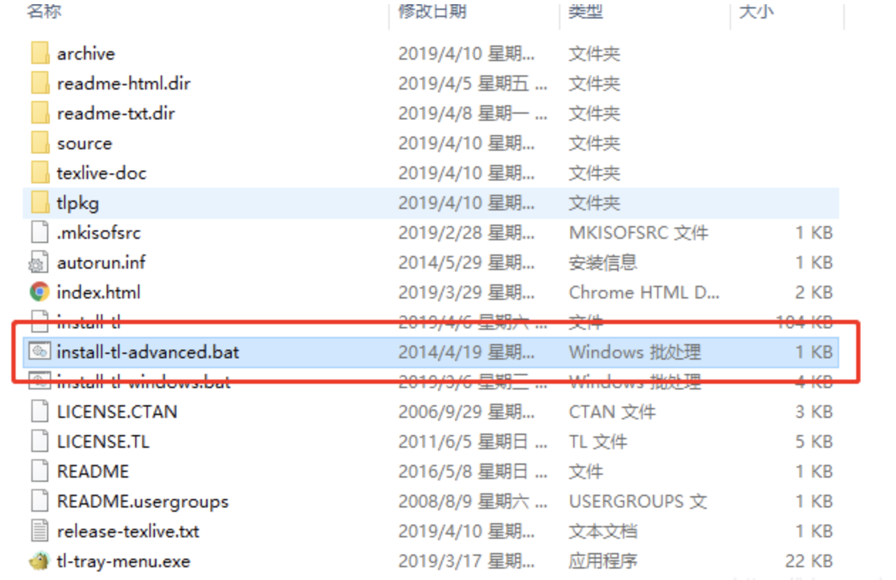

### Deep-Learning技术基础

#### 环境篇

##### 1. 安装conda

创建环境

```shell
conda create -n env_name python=version # -n env_name 表示创建的环境的名字为env_name 
source activate envs_name #进入环境
conda deactivate #退出环境
conda remove -n env_name --all #删除环境
```

##### 2. 安装pytorch

从官网获取安装命令[https://pytorch.org/get-started/locally/](https://pytorch.org/get-started/locally/)

对应不同的系统、软件和CUDA版本

` conda install pytorch torchvision cudatoolkit=10.2 -c pytorch`

同时可以配置一下国内的源，下载速度会更快。

``` shell
# 配置国内源，方便安装Numpy,Matplotlib等
conda config --add channels https://mirrors.tuna.tsinghua.edu.cn/anaconda/pkgs/free/ 
conda config --add channels https://mirrors.tuna.tsinghua.edu.cn/anaconda/pkgs/main/
# 配置国内源，安装PyTorch用
conda config --add channels https://mirrors.tuna.tsinghua.edu.cn/anaconda/cloud/pytorch/ 
# 显示源地址
conda config --set show_channel_urls yes


#选择指定版本，安装pytorch
conda install pytorch=0.3.1 torchvision cuda90
```
```
#安装一些常用的包
conda install scikit-learn
conda install jupyter notebook
conda install pandas
```

#### 理论篇

##### 1. 论文阅读

有条件的，adobe的PDF

没条件的，福昕PDF免费版也OK（windows系统下更推荐）

##### 2. 论文写作

Latex写作：

windows：texlive+TeXstudio

​	texlive下载[清华源镜像](https://mirrors.tuna.tsinghua.edu.cn/CTAN/systems/texlive/Images/) https://mirrors.tuna.tsinghua.edu.cn/CTAN/systems/texlive/Images/

​	双击批处理安装



​	[TeXstudio](https://www.texstudio.org/) https://www.texstudio.org/

mac：Mactex+vs code

linux：texlive


#### 实践

LR：LogisticRegression 逻辑回归

loss 损失


（pytorch）一个神经网络的典型训练过程如下：

- 定义包含一些可学习参数(或者叫权重）的神经网络
- 在输入数据集上迭代
- 通过网络处理输入
- 计算损失(输出和正确答案的距离）
- 将梯度反向传播给网络的参数
- 更新网络的权重，一般使用一个简单的规则：`weight = weight - learning_rate * gradient`


pytorch部署resnet18：


tips：

1. pycharm中，取消matplotlib默认输出到sciview：取消Settings | Tools | Python Scientific | Show plots in toolwindow勾选项